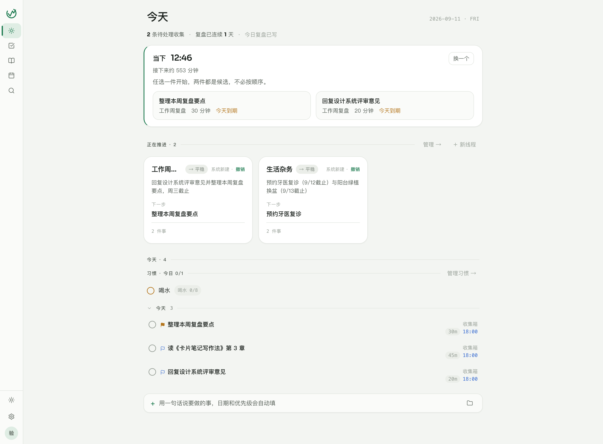
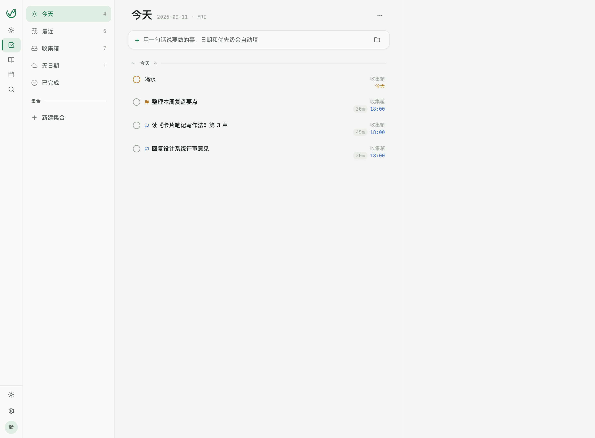
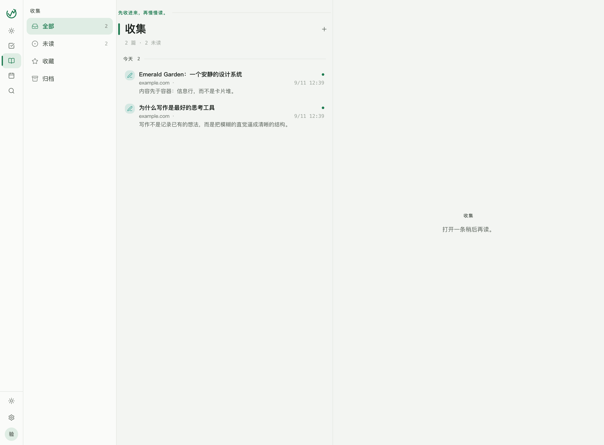
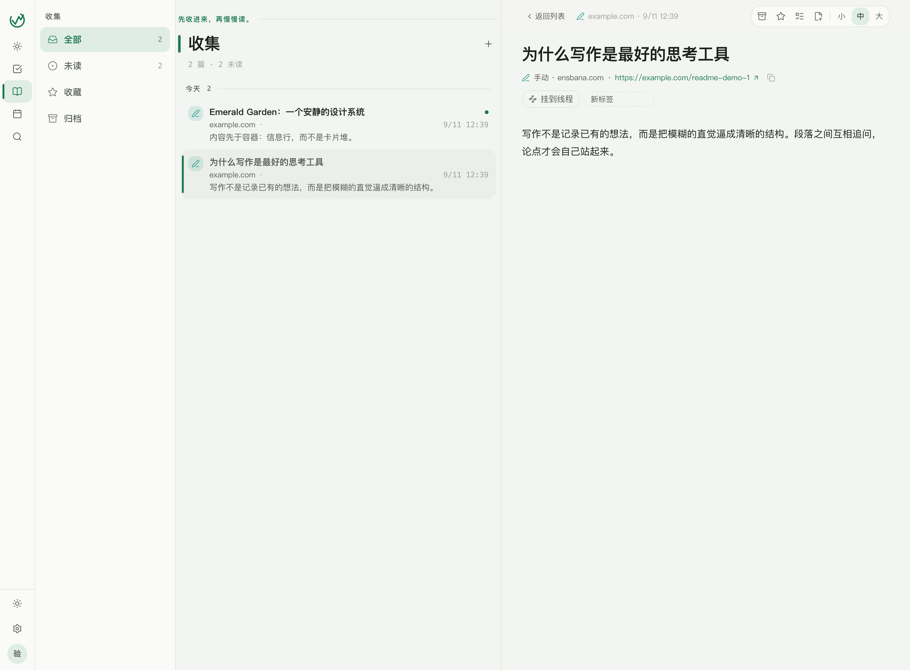
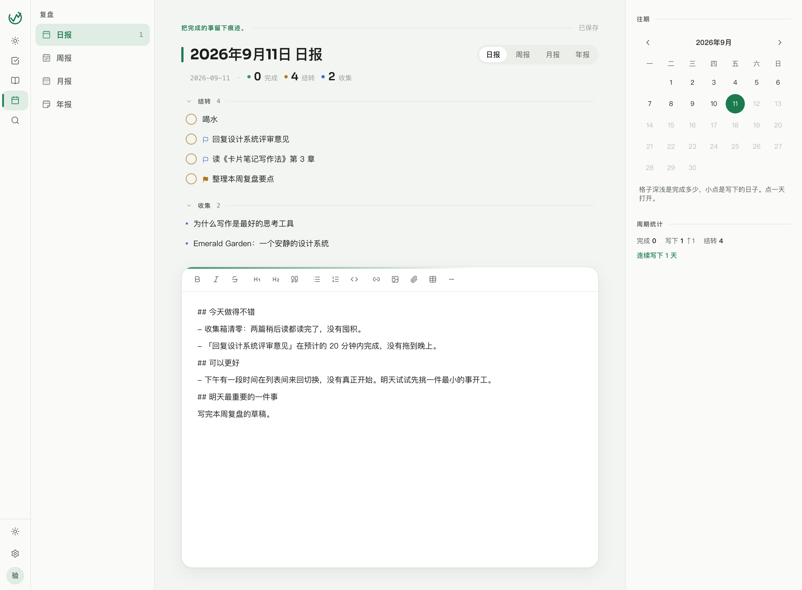
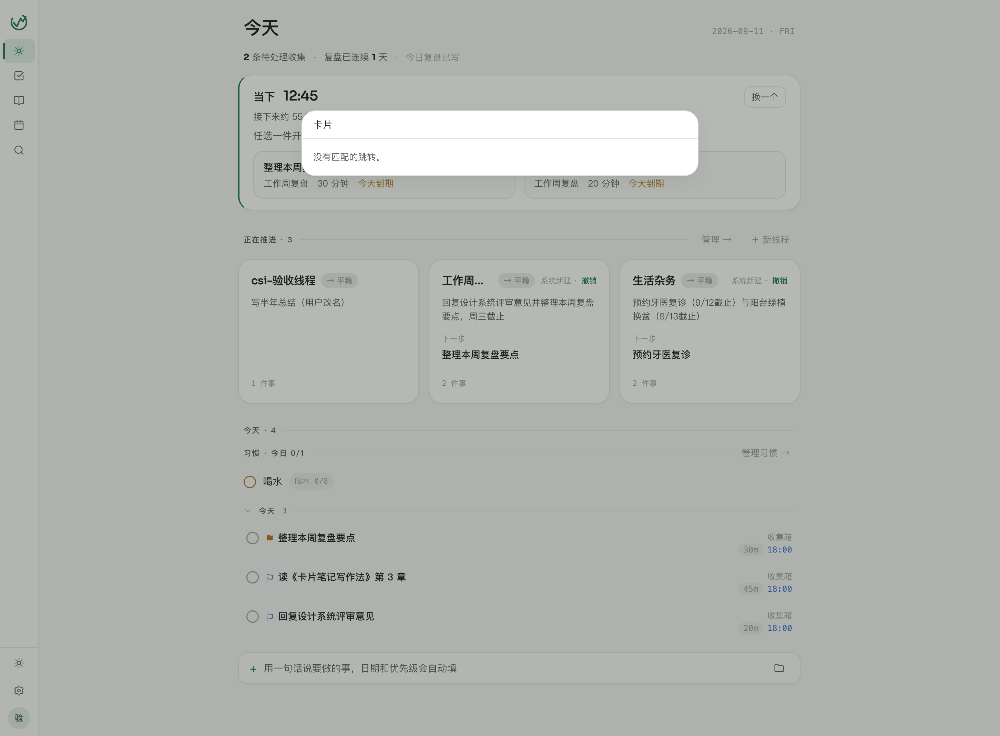

# Vital

个人操作系统：**收集（Inbox）→ 执行（Todos）→ 复盘（Reports）**。

> [English documentation](README_EN.md)

Vital 是一个中文优先（`zh-CN`）、单用户的自托管个人效率系统 —— 待办、稍后读、习惯与复盘都在同一个安静的工作区里，不追赶协作，不制造焦虑。

## 产品理念

Vital 追求的是 **Calm Productivity（安静而有行动力）**：打开后先看到"接下来做什么"，而不是系统本身。

- **一个闭环，而不是一堆工具**。链接先丢进收集箱，读完后一键转为任务；任务完成后自动汇入当天的复盘；复盘里沉淀的想法再变成明天的行动。
- **内容先于容器**。待办、阅读、复盘都是可直接操作的信息行，不是卡片堆；结构靠排版、发丝线和疏密节奏表达。
- **状态有意义，但不制造焦虑**。逾期只着色日期，绝不把整条任务染红；没有红点、没有 KPI 大数字。
- **单用户，数据归自己**。一个账户就是全部；Postgres 里的每一行都是你自己的数据，随时可以迁走。

视觉主题为 **Emerald Garden（翡翠园）**：暖白纸面、翡翠绿、深墨与暗色下的发光薄荷。设计规范见 [docs/vital-calm-productivity-design-system.md](docs/vital-calm-productivity-design-system.md)。

## 功能一览

### 今天 · 从"当下的一件事"开始

此刻卡片自动从今天的任务里挑出候选，配合习惯打卡与推进中的线程，一屏回答"现在做什么"。



### 待办 · 信息行，不是卡片

清单、标签、优先级、估时、截止日期与重复规则；习惯与线程有各自的视图。



### 收集 · 先收进来，再慢慢读

粘贴链接自动抽取正文；列表 + 双栏阅读器，可调字号、归档、收藏、转任务、挂到线程。




### 复盘 · 把完成的事留下痕迹

日 / 周 / 月 / 年报共用一个 Markdown 编辑器；进行中的任务和稍后读可自动填充进报告，往期以日历热度图回顾。



### 搜索与命令面板

`⌘K` 呼出命令面板：跳转、搜索一步完成；搜索由 Meilisearch（关键词）+ Qdrant 向量召回 + 重排序驱动。



### 更多能力

- **Agent 洞察**：基于 LLM 的任务拆解、草稿与洞察通知；持久化调度、每日模型预算、执行链路遥测与成本观测。LLM Key 在设置页按需配置。
- **多端同步**：Web（cookie auth）、Desktop（Tauri 2）、Mobile（Expo）、Chrome 扩展（MV3/WXT），统一同步协议。
- **开放 API**：设置页可签发 `vt_` 前缀的个人访问令牌；API 目录由服务端路由自动生成（`pnpm gen:vital-skill`），并附带可让 Claude 等 Agent 直接操作 Vital 的 [skill](skills/vital/SKILL.md)。
- **通知推送**：worker 进程负责提醒与推送（MeoW）。

## 技术架构

pnpm workspace + Turbo，Node ≥ 22，包名 `@vital/*`。

```
apps/web          Vite / React（cookie auth）
apps/desktop      Tauri 2（bearer；内嵌 web UI）
apps/mobile       Expo（bearer）
apps/extension    Chrome MV3 / WXT（bearer）
apps/server       Fastify 5 + Drizzle + PostgreSQL
packages/tokens   设计 tokens（Pulse / Sora）
packages/dto      Zod DTO 与报告模板（前后端共享）
packages/api-client  生成的 API client
packages/markdown 报告编辑器的 Markdown 渲染
packages/*       共享的 eslint / tsconfig 预设
```

| 服务                        | 端口     |
| --------------------------- | -------- |
| API（`apps/server`）        | **3010** |
| Web / Vite / Tauri `devUrl` | **5180** |

## 本地开发

```bash
pnpm install

# 1. 准备数据库：任意可达的 PostgreSQL 16（需要 pg_trgm 扩展）
# 2. 配置环境变量
cp apps/server/.env.example apps/server/.env   # 替换所有 change-me，.env 不入库

# 3. 一键启动：迁移 + API :3010 + worker + Web :5180
./dev.sh
```

首次使用可在 Web 注册后执行 seed 造三条示例收集（仅开发环境）：

```bash
NODE_ENV=development pnpm --filter @vital/server seed you@example.com
```

质量检查：

```bash
pnpm lint
pnpm typecheck
pnpm test          # 服务端测试需要 compose 里的 vital_test 库（:5433）
```

运行服务端测试前：`docker compose up -d postgres`（根目录 compose 提供 5433 上的 `vital_test`），并在 `apps/server/.env.test` 里配置测试库连接（参考 `docs/project-standards.md`）。检索组件（Qdrant / Meilisearch / DashScope embedding）全部可选，未配置时对应功能自动降级关闭。

## 部署

生产环境使用 GHCR 镜像 + Docker Compose，提供两种拓扑：

**自带 Postgres（单机）** —— [docker-compose.prod.yml](docker-compose.prod.yml)：`migrate → server → worker → web`，web 暴露 HTTP 端口，前置任意反向代理即可上 HTTPS。

**外部 Postgres（推荐）** —— [docker-compose.prod.external.yml](docker-compose.prod.external.yml)：数据库与备份托管在专门的 db 主机，compose 只跑 server / worker；宿主 nginx（见 [deploy/nginx.conf](deploy/nginx.conf)）反代到 `127.0.0.1:3010`。

```bash
cp .env.production.example .env    # 填入真实密钥与 PG_HOST；.env 不入库
docker compose -f docker-compose.prod.external.yml pull
docker compose -f docker-compose.prod.external.yml run --rm migrate
docker compose -f docker-compose.prod.external.yml up -d
```

健康检查：`GET /api/health`（进程存活）与 `GET /api/v1/health/ready`（`SELECT 1`）。

## 贡献

```bash
pnpm install
pnpm lint && pnpm typecheck && pnpm test
```

- **工程规范**：[docs/project-standards.md](docs/project-standards.md)（测试数据库、私有附件签名 URL、视觉实现约束等，改动相关领域前必读）。
- **设计规范**：[docs/vital-calm-productivity-design-system.md](docs/vital-calm-productivity-design-system.md)（色彩 / 字级 / 间距 / 组件的唯一事实来源是 `packages/tokens`，token 需 `theme.ts` 与 `css/semantic.css` 双改）。
- **数据库迁移**：schema 变更改 `apps/server/src/db/schema`，经 `pnpm --filter @vital/server migrate:generate` 生成迁移，`pnpm --filter @vital/server migrate` 应用。
- **API 文档**：路由或 DTO 变更后执行 `pnpm gen:vital-skill` 重新生成 [skills/vital/references/api.md](skills/vital/references/api.md)。
- **截图**：`docs/screenshots/` 中的图片来自本地 dev 环境（Emerald Garden 主题，浅色模式）；UI 大改后请同步更新。

提交信息沿用现有风格：`feat: / fix: / refactor: …`（中文描述）。
