# Vital

An **AI-first personal operating system**: **Capture (Inbox) → Execute (Todos) → Reflect (Reports)**.

Vital is a Chinese-first (`zh-CN`), single-user, self-hosted personal productivity system. Todos, read-later, habits, threads, and reviews live in one calm workspace. **Inside the product, a resident agent organizes, decomposes, drafts, and remembers your preferences. Outside, a skill lets Claude, Codex, and other agents operate the same data.**

No collaboration features to chase, no anxiety to manufacture. One account is the whole system.

> [中文文档](README.md)

| Light | Dark |
| --- | --- |
|  | 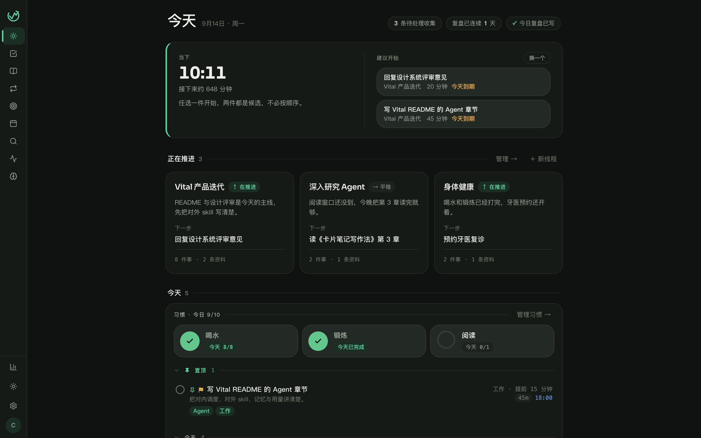 |

## Philosophy

Vital is **AI-first** and still pursues **Calm Productivity**: when you open it, the first thing you see is "what to do next" — not the system itself. The agent works in the background; proposals land only when you accept them.

- **One loop, not a pile of tools.** Drop a link into the inbox, read it later, convert it to a task in one click. Finished work flows into the day's review; ideas distilled in reviews become tomorrow's actions. The agent discovers threads, breaks down deferred tasks, drafts plans, writes the daily report, and turns your corrections into long-term memory.
- **Content over containers.** Todos, reading, and reviews are directly manipulable information rows, not stacks of cards. Structure comes from typography, hairlines, and rhythm.
- **Status with meaning, but no anxiety.** An overdue task only tints its date — never the whole row. No red dots, no big KPI numbers.
- **Single user, your data.** Every row in Postgres belongs to you. LLM keys are optional and configured on demand; usage and cost stay visible.

The visual theme is **Emerald Garden**: warm paper whites, emerald green, deep ink, and a glowing mint in dark mode. Full spec (Chinese): [docs/vital-calm-productivity-design-system.md](docs/vital-calm-productivity-design-system.md).

## Agent · two paths

Vital treats the agent as part of the product, not a chat overlay.

1. **Internal.** A worker-process agent watches tasks, habits, and feedback, runs on a persistent schedule, and emits proposals you can accept.
2. **External.** The [skills/vital](skills/vital/SKILL.md) skill lets other agents call the same HTTP API with a personal access token.


### Internal: how the agent works

After you configure a model (Settings → Models, OpenAI Chat Completions compatible), the worker scans the schedule about every 30 seconds. Debounce, cooldown, leases, retries, and the daily budget live in PostgreSQL — not in process memory — so a restart continues the work.

Everything is per-user: the model only sees the current user's data; the same capability does not run in parallel for one user. A configurable global concurrency limit is shared across users. Each user gets 100 background model calls per local day by default; overflow slips to the next day.

| Capability | What it does | Default trigger |
| --- | --- | --- |
| Board status `agent.headline` | One-line thread status and next step | Debounce after task changes; daily pass for stale threads |
| Thread clustering `agent.cluster` | Find and name threads from unfiled tasks | Debounce after task changes; at least 4 open non-habit tasks |
| Decompose `agent.decompose` | Split a repeatedly deferred task into subtasks | Defer-count trigger; you must accept |
| Draft `agent.draft` | Write an execution plan for a delegable task | Manual from the task detail |
| Report `agent.report` | Draft the daily report from done / carried / captured | "Generate" on the report page |
| Reflect `agent.reflect` | Scan every thread and refresh status | Once a day |
| Distill `agent.distill` | Learn preferences from your corrections | 3 new feedbacks, or 1 edit/reject, then debounce |
| Notify `agent.notify` | Turn an insight into one spoken sentence | Periodic scan |
| Critic `agent.critic` | Second-pass check (off by default; doubles cost) | Per routing config |

Proposals never silently mutate your data. Accept, dismiss, or correct them on Today, on the thread page, or under **Activity**. Hand-written memories outrank distilled ones; distill will not overwrite or delete them.

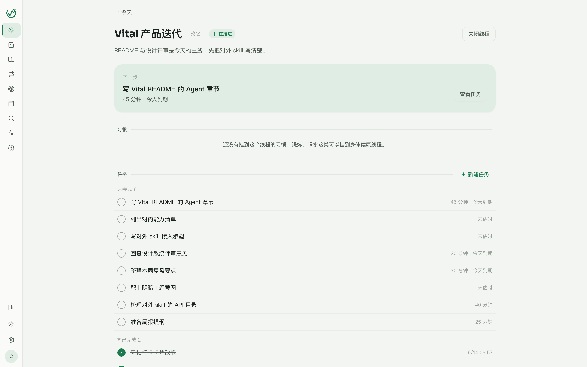

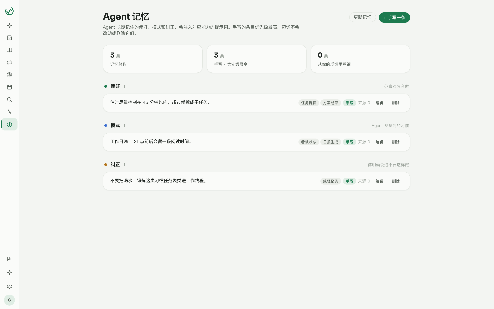

**Activity** shows what the agent is waiting for, what it ran, and why it skipped (no model yet, daily budget exhausted, …). You can run a capability now or cancel accumulated observations without turning the capability off.

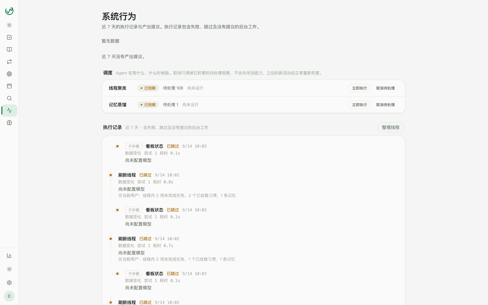

Each capability can use a different model. Task parse, headline, cluster, decompose, draft, report, memory, notify, and critic can be routed independently; unset routes follow Default.

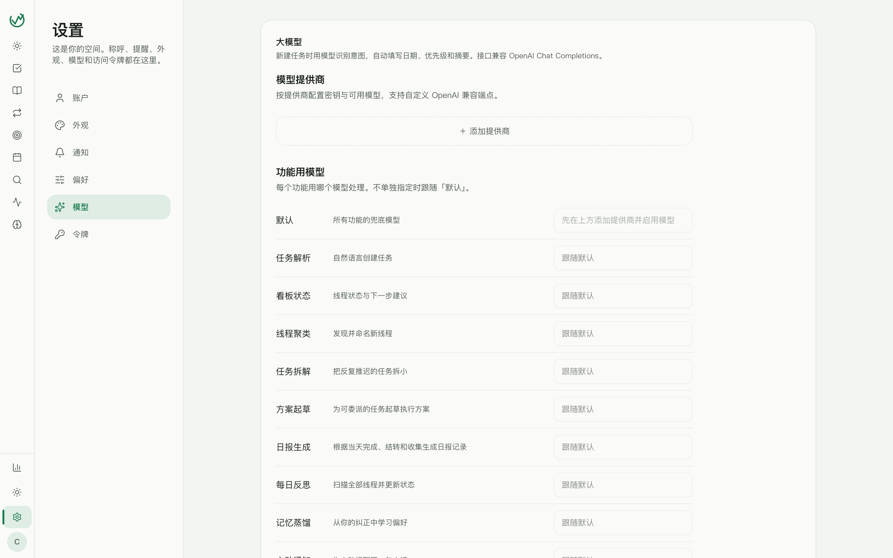

Scheduling, leases, budget, and restart guarantees: [docs/agent-scheduling.md](docs/agent-scheduling.md) (Chinese).

### External: a skill for other agents

The repo ships an installable skill: [skills/vital/SKILL.md](skills/vital/SKILL.md). Claude, Codex, Cursor, or any agent that can load skills can operate your Vital without another chat product.

1. Issue a `vt_`-prefixed personal access token in **Settings → Tokens** (plaintext shown once; revocable anytime).
2. Install the skill, or set `VITAL_TOKEN` / `VITAL_API_URL`.
3. The API catalog is generated from server routes (`pnpm gen:vital-skill` → [skills/vital/references/api.md](skills/vital/references/api.md)). Do not invent fields.

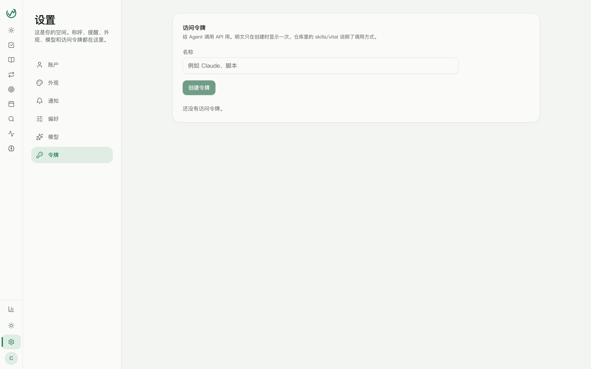

Workflows documented in the skill:

- **Today:** `GET /api/v1/today` (threads, tasks, pulse, now-recommendations).
- **Today's tasks:** `GET /api/v1/tasks?listId=smart:today`. Natural-language create: `POST /api/v1/tasks/from-text` (needs LLM settings).
- **Threads:** `GET /api/v1/outcomes?status=open`. Detail: `GET /api/v1/outcomes/:id/detail`.
- **Capture a document:** `POST /api/v1/inbox` with `markdown` or `extractedHtml` (stored as TipTap). URL capture: extract then create. Read body: `GET /api/v1/inbox/:id/markdown`.
- **Habits:** `GET /api/v1/habits`, then `POST /api/v1/habits/:id/tick`.
- **Days:** `GET /api/v1/days`.
- **Search:** `POST /api/v1/search`, optionally scoped to task / inbox / report.
- **Daily / weekly report:** `GET /api/v1/reports/current?type=daily`, then `PATCH` with the current `revision`.

Internal agent and external skill share one dataset: edits in the web UI show up for Claude; tasks Claude creates appear on Today immediately.

## Today · start with the one thing for right now

The "now" card picks candidates from today's tasks (not a fixed sequence — "swap" only rotates locally). Below that: open threads, habit check-ins, and today's rows. A pulse strip shows leftover inbox items and whether today's review is written.

If a model is configured, a one-line add parses dates, priority, and a summary.

## Todos · information rows, not cards

Lists, tags, priorities, estimates, due dates, reminders, and recurrence. Subtasks hang under the parent; detail opens on the right. Habit instances stay out of the regular list.

- **List / board / week** views. Board splits by status or priority; week spreads occurrences on a calendar.
- Smart lists: Today, Recent, Inbox, No date, Done.
- Recurrence: daily, weekly, monthly, yearly, weekdays, weekends, holidays, legal workdays.
- Reminders: on due, 5 / 15 / 30 minutes / 1 hour / 1 day before, or a custom time.
- Pin, postpone, drag-reorder, context menus; `N` to create, `E` to complete.
- Mark a task **delegable** and the agent can draft a plan; review it into notes or as subtasks.


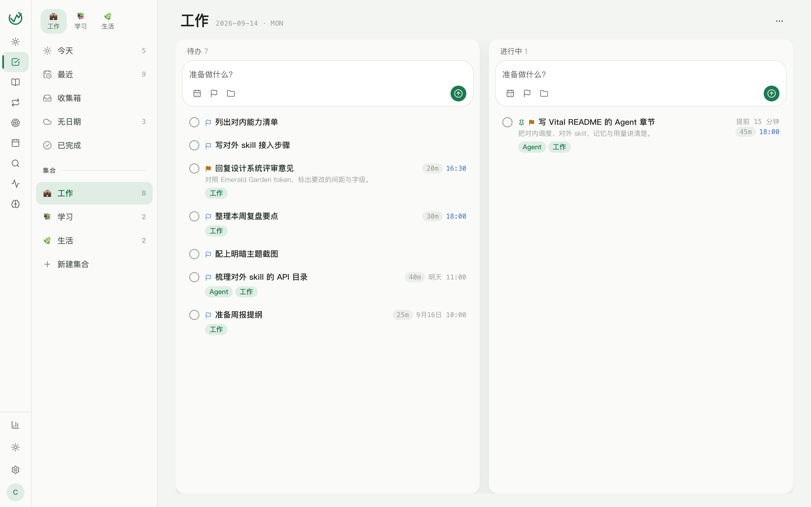

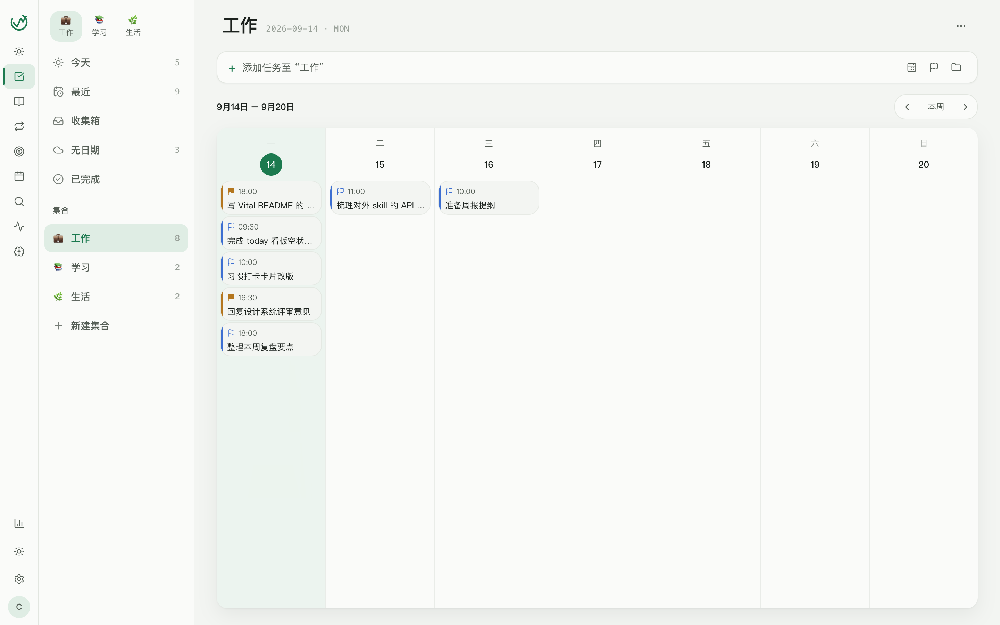

The same list in dark mode:

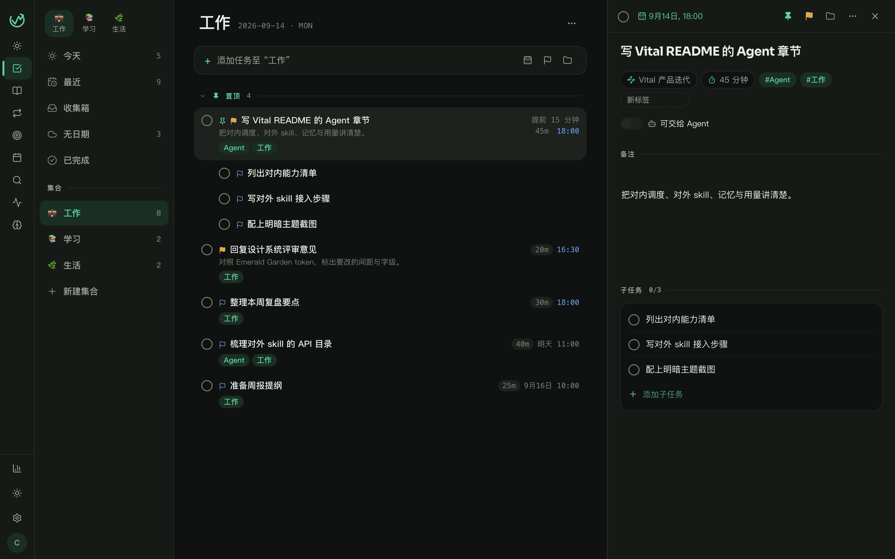

## Inbox · capture first, read at your pace

Paste a link and the article body is extracted; you can also save a note with no URL. List plus a two-pane reader: font size, archive, favorite, copy original, convert to a task, attach to a thread, pin into a report.

Sources: web, browser extension, WeChat, mobile, or manual. Filters: all / unread / favorites / archived, plus tags.


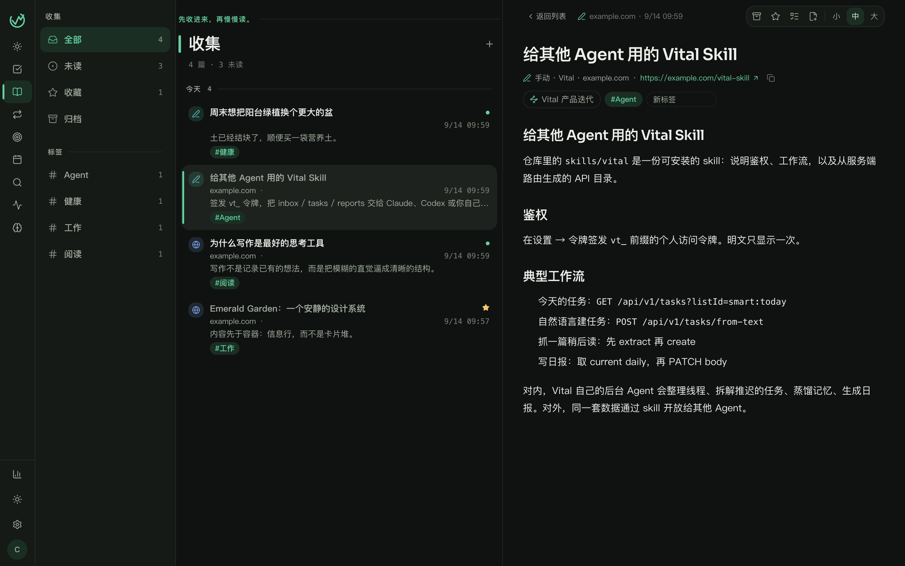

The Chrome extension (MV3 / WXT) saves the current page, a selection, or an image into read-later or todos. Login goes through `/auth/extension`.

## Habits · small tasks spawned every day

Habits are not sticker checkboxes — they spawn today's tasks inside a time window. Daily-once or count (e.g. 8 glasses of water). Completing one count instance spawns the next until the target.

A habit can belong to a thread (exercise and water → Health; reading → a learning thread). Progress shows on Today's thread cards. Deactivating stops spawning; history stays.

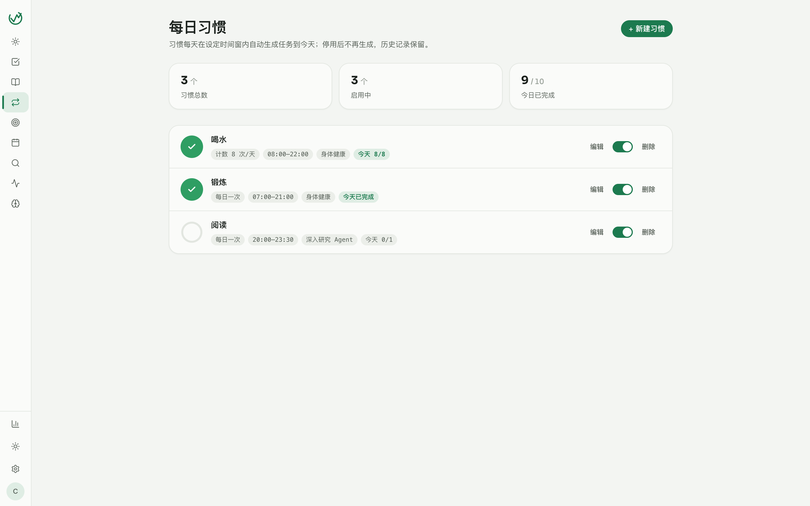

## Threads · what you are actually pushing forward

A thread is a goal orthogonal to lists. Each card on Today has status, next step, open-task count, and attached materials. Closing hides it from Today; tasks and materials remain and can be reopened. Agent-created threads can be undone inside a short window.

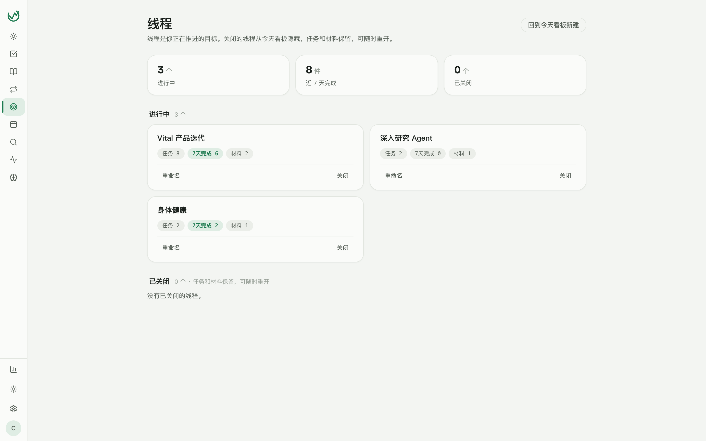

## Reports · leave a trace of what you did

Daily / weekly / monthly / yearly reports share one Markdown editor (headings, lists, quotes, code, tables, images, attachments). Open tasks and read-later items can be auto-filled; `/` inserts a task or inbox chip. Past periods sit on a calendar heatmap: cell depth is how much you finished; a dot marks a day you wrote.

With a model configured, daily reports support one-click generate.


## Search and command palette

`⌘K` (`Ctrl+K` on Windows / Linux) opens the command palette: jump to lists, tasks, threads, or read-later. The full search page is Meilisearch (keywords) + Qdrant vector recall + reranking. Unconfigured retrieval pieces degrade off.


## Light and dark

Light, dark, or follow the system. Web, desktop, and mobile share the same Emerald Garden tokens (`packages/tokens`). Toggle from the rail, or Settings → Appearance.

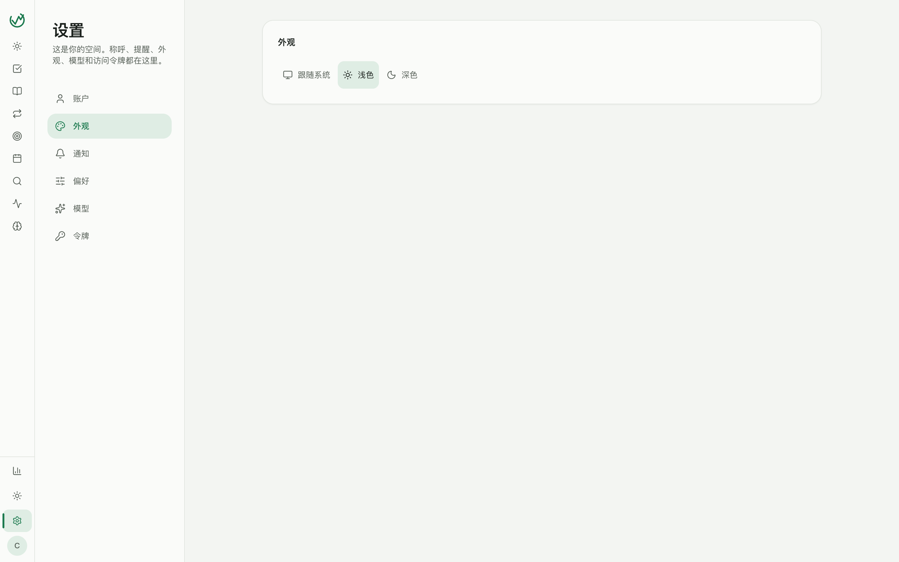

## Web · desktop · mobile

Three clients, one sync protocol, one backend. Desktop wraps the web UI; mobile is a native layout for the phone.

| Client | Stack | Auth |
| --- | --- | --- |
| **Web** | Vite / React at `:5180` | Cookie (httpOnly refresh) |
| **Desktop** | Tauri 2 embedding the same web UI | Bearer in a local store |
| **Mobile** | Expo / React Native (Android) | Bearer; can self-update the APK from GitHub Releases |
| **Extension** | Chrome MV3 / WXT | Bearer, for one-click capture |

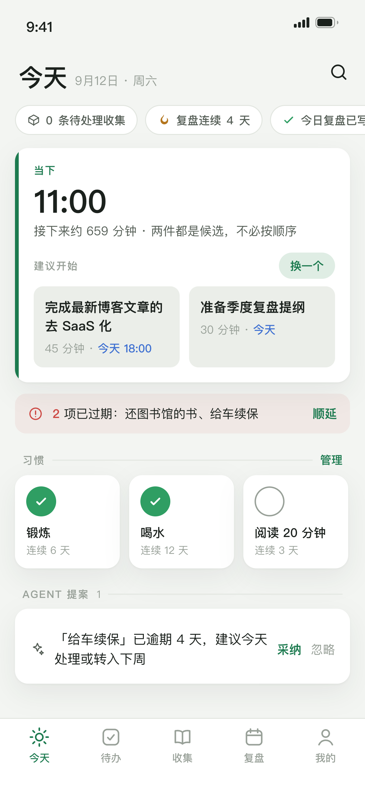

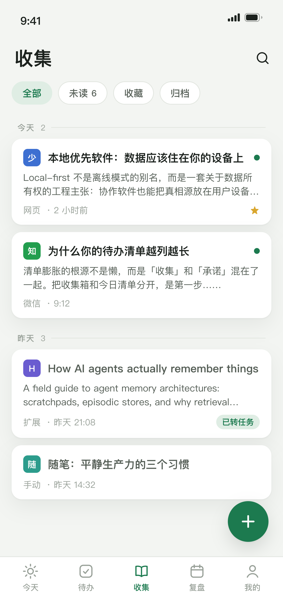

Android release: push a `vMAJOR.MINOR.PATCH` tag; `.github/workflows/android-release.yml` attaches `app-release.apk`. The app reads `GET /api/v1/app/android` on launch; a newer `versionCode` downloads in the background and installs from Me.

## More

- **Natural-language create:** "Reply to the design review by Friday" fills date, priority, and a summary.
- **Tags and list icons:** shared tags on tasks and inbox items; lists take an emoji or an uploaded icon, and can nest.
- **Notifications:** OS notifications plus optional [MeoW](https://meow.cc); a default clock for all-day tasks; quiet hours; agent insights can be toggled separately.
- **Usage and cost:** every model request is logged by day and capability (connection tests, task parse, background work). Unknown usage is not treated as zero. See the **Usage** page.

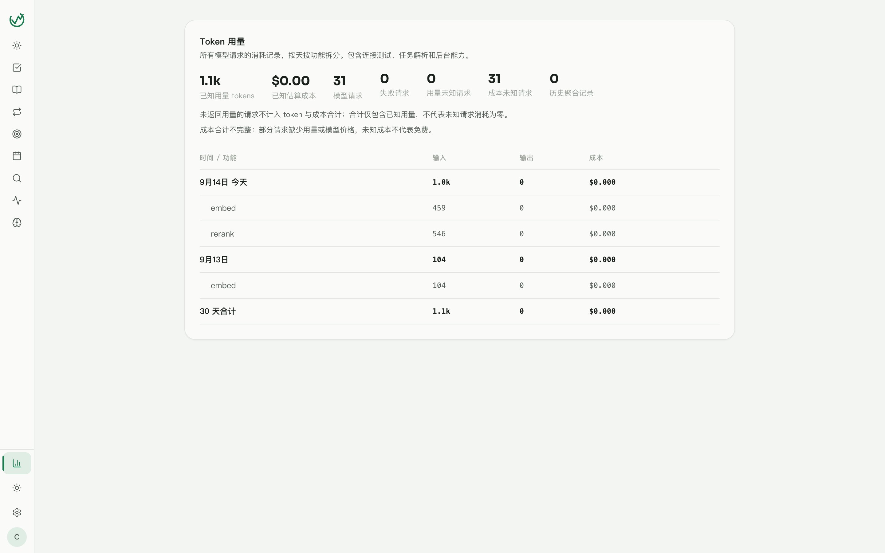
- **Sync:** web / desktop / mobile / extension share one change-set. Inbox HTML/text lives in `inbox_item_bodies`; list sync omits the body so a reader cache cannot be blanked.
- **Retrieval (optional):** Meilisearch + Qdrant + DashScope embedding / rerank. Unset pieces turn the matching feature off.
- **Open API:** any script with a `vt_` token can call `/api/v1`. The last 30 days of calls are visible on the token page.
- **Onboarding:** a three-step checklist (save a page, create today's task, open the weekly report), skippable anytime.

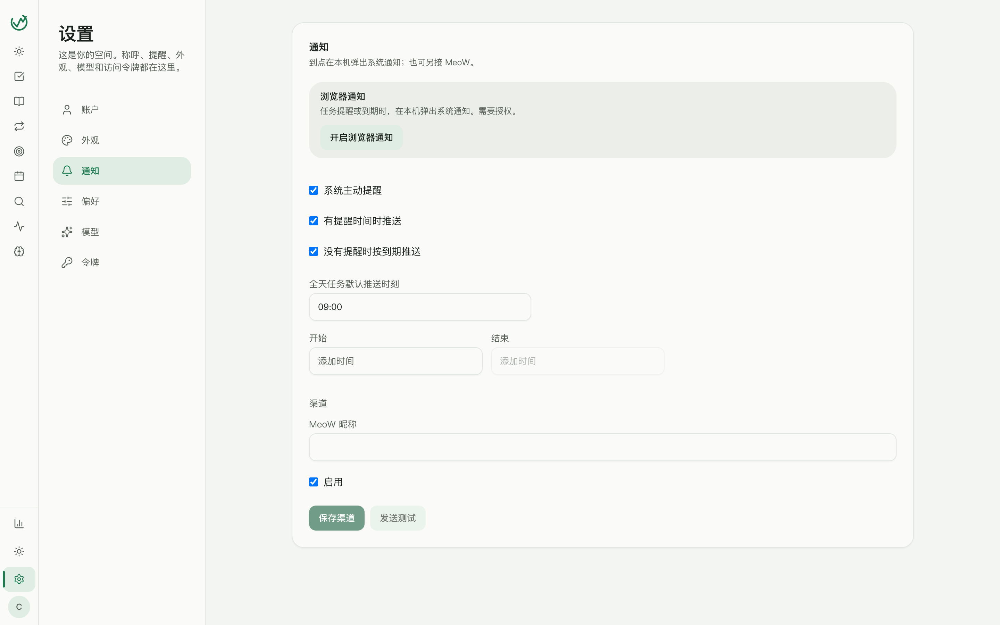

## Architecture

pnpm workspace + Turbo. Node ≥ 22. Packages are named `@vital/*`.

```
apps/web          Vite / React (cookie auth)
apps/desktop      Tauri 2 (bearer; wraps the web UI)
apps/mobile       Expo (bearer)
apps/extension    Chrome MV3 / WXT (bearer)
apps/server       Fastify 5 + Drizzle + PostgreSQL
packages/tokens   Design tokens (Pulse / Sora)
packages/dto      Zod DTOs and report templates (shared)
packages/api-client  Generated API client
packages/markdown Markdown rendering for the report editor
packages/*        Shared eslint / tsconfig presets
```

| Service                      | Port     |
| ---------------------------- | -------- |
| API (`apps/server`)          | **3010** |
| Web / Vite / Tauri `devUrl`  | **5180** |

Tables have **no PostgreSQL foreign keys**. `user_id` / `*_id` are plain `char(36)`; ownership, existence, and cascade cleanup live in the service layer, in one transaction. See [AGENTS.md](AGENTS.md).

## Local development

```bash
pnpm install

# 1. Prepare a database: any reachable PostgreSQL 16 (requires the pg_trgm extension)
# 2. Configure environment variables
cp apps/server/.env.example apps/server/.env   # replace every change-me; .env is gitignored

# 3. One-command start: migrations + API on :3010 + worker + Web on :5180
./dev.sh
```

After registering in the Web app, you can seed three sample inbox items (development only):

```bash
NODE_ENV=development pnpm --filter @vital/server seed you@example.com
```

Quality checks:

```bash
pnpm lint
pnpm typecheck
pnpm test          # server tests need the vital_test database from compose (:5433)
```

Before running server tests: `docker compose up -d postgres` (the root compose file provides `vital_test` on port 5433) and configure the test database connection in `apps/server/.env.test` (see `docs/project-standards.md`). Retrieval components (Qdrant / Meilisearch / DashScope embeddings) are all optional — unset pieces degrade the corresponding feature off automatically.

After editing `apps/server/src/db/schema/**`, **restart the worker** as well (`pnpm --filter @vital/server worker`). API `tsx watch` reloads; the worker process does not.

## Deployment

Production uses GHCR images + Docker Compose, in two topologies:

**Bundled Postgres (single host)** — [docker-compose.prod.yml](docker-compose.prod.yml): `migrate → server → worker → web`. The web service exposes an HTTP port; put any reverse proxy in front for HTTPS.

**External Postgres (recommended)** — [docker-compose.prod.external.yml](docker-compose.prod.external.yml): the database and backups live on a dedicated DB host, and compose runs only server / worker. Host nginx (see [deploy/nginx.conf](deploy/nginx.conf)) reverse-proxies to `127.0.0.1:3010`.

```bash
cp .env.production.example .env    # fill in real secrets and PG_HOST; .env is gitignored
docker compose -f docker-compose.prod.external.yml pull
docker compose -f docker-compose.prod.external.yml run --rm migrate
docker compose -f docker-compose.prod.external.yml up -d
```

Health checks: `GET /api/health` (process liveness) and `GET /api/v1/health/ready` (`SELECT 1`).

## Contributing

```bash
pnpm install
pnpm lint && pnpm typecheck && pnpm test
```

- **Engineering standards**: [docs/project-standards.md](docs/project-standards.md) (Chinese) — test databases, signed URLs for private attachments, visual implementation constraints. Read before touching these areas.
- **Design system**: [docs/vital-calm-productivity-design-system.md](docs/vital-calm-productivity-design-system.md) (Chinese) — the single source of truth for color / type / spacing / components is `packages/tokens`; a token change must update both `theme.ts` and `css/semantic.css`.
- **Database migrations**: edit `apps/server/src/db/schema`, generate migrations with `pnpm --filter @vital/server migrate:generate`, and apply them with `pnpm --filter @vital/server migrate`.
- **API docs**: after changing routes or DTOs, run `pnpm gen:vital-skill` to regenerate [skills/vital/references/api.md](skills/vital/references/api.md).
- **Screenshots**: images in `docs/screenshots/` come from local dev (Emerald Garden, light and dark, plus mobile). Update them after major UI changes.

Commit messages follow the existing style: `feat: / fix: / refactor: …` (Chinese descriptions).
