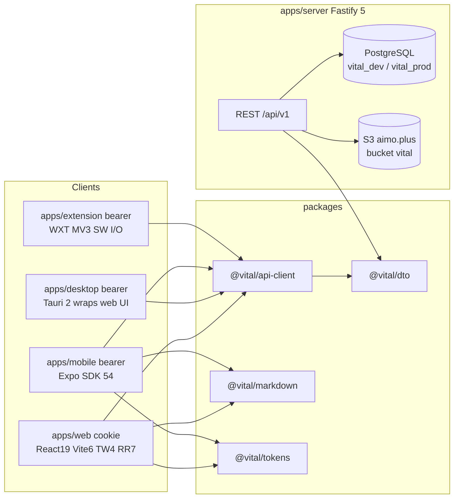
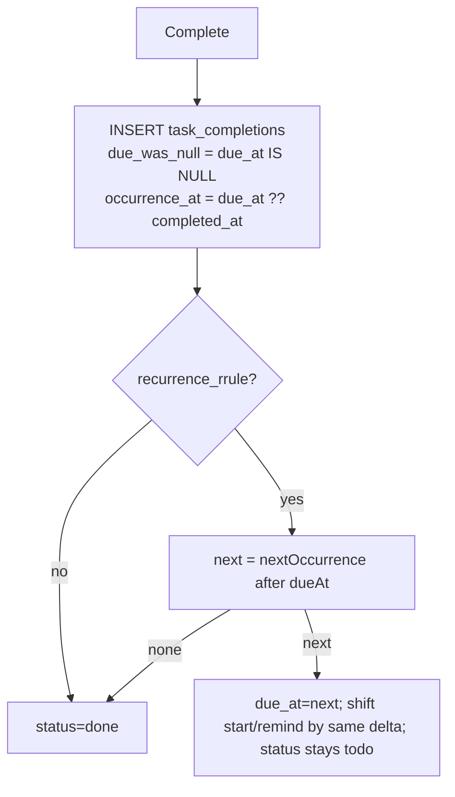
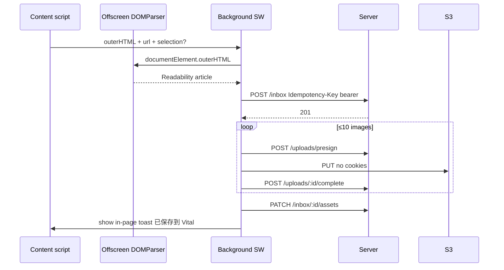
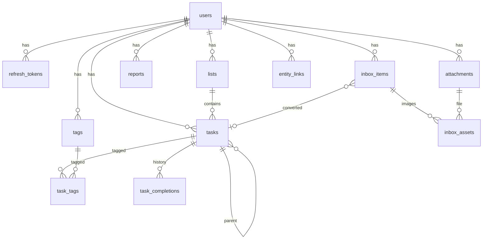

# Vital — commercial personal productivity OS

| Field | Value |
|---|---|
| Author | Grok (design) |
| Date | 2026-09-06 |
| Status | Draft (rev 5 — review 4 addressed) |
| Repo | `/Users/ximing/project/mygithub/vital` (greenfield; stub `package.json` with `pnpm@10.30.3`) |
| Reference architecture | `/Users/ximing/project/mygithub/moment` — **copy infra/tooling patterns, do not copy the product** |

---

## Overview

Vital is a commercial-grade **personal OS** for one human: **Capture (Inbox / 稍后读) → Execute (Todos) → Reflect (日报/周报/月报/年报)**. The v1 surface must feel like TickTick + Pocket, not a student CRUD demo: empty states, keyboard-first web, onboarding, loading/error/offline, undo, search, recurrence, and smart lists. UI is **Chinese-first (zh-CN)** with English i18n keys. One user per account; no team sharing in v1.

The technical bet is a **pnpm + turbo monorepo** cloned from Moment's workspace/tooling/S3/auth/DTO/client patterns, with product-appropriate substitutions: **Fastify 5** instead of Express/`routing-controllers`, **PostgreSQL** instead of MySQL, **argon2id** instead of bcrypt, **httpOnly refresh cookies only on same-origin web** (Vite proxy + prod nginx), **bearer tokens for Tauri / Chrome extension / mobile**, and a **pulse/circadian** visual system instead of Moment's warm cream/coral sticker look.

Five apps ship from one contract (`packages/dto` + `packages/api-client`): `web` (React 19.1 + Vite 6 + Tailwind v4 + React Router 7), `desktop` (Tauri 2 wrapping the web UI, **bearer** auth), `mobile` (Expo SDK 54 + expo-router), `extension` (Chrome MV3 via WXT, **bearer**, API I/O in the background service worker), `server` (Fastify 5 + Drizzle + PostgreSQL + Zod).

---

## Background & Motivation

Moment already solved the hard unglamorous parts of shipping a personal product on this machine:

- Monorepo: `pnpm-workspace.yaml` (`apps/*`, `packages/*`, `config/*`), `turbo.json` (`build` depends on `^build`, `dev` persistent + `^build`), root `package.json` scripts `dev/build/test/lint/format`.
- Typed boundary: `packages/dto` (Zod schemas + inferred types) consumed by server and clients; `packages/api-client` (`Http` with single-flight 401 refresh, `ApiError` from `{ error: { code, message, details? } }`, `TokenStore`, presigned PUT helper).
- Private S3: `apps/server/src/storage/{base.adapter,s3.adapter,factory}.ts` — relative keys, prefix join, `storage_meta` snapshot per row, presign PUT → HeadObject complete, GET 302 to signed URL.
- Auth: email+password, JWT access 15m, hashed rotating refresh 30d, `passwordChangedAt` invalidates old access tokens (`apps/server/src/auth/{password,token.service,authorization,auth.service}.ts`).
- Theme: CSS variables on `:root` / `[data-theme=dark]` mapped by Tailwind (`apps/web/src/styles/tokens.css`, `apps/web/tailwind.config.js`); RN duplicate as a TS object (`apps/app/src/theme/tokens.ts`) with `light` / `dark` / `system` persisted (`apps/web/src/lib/theme.ts`, `apps/app/src/theme/preference.ts`).
- Ops: `dev.sh` boots API + web; Dockerfiles copy workspace manifests so pnpm does not leave dangling workspace symlinks; nginx later reverse-proxies `/api/` (`deploy/nginx.conf`).

Vital is a different product (tasks + later-read + living reports) on the same operator machine, so it **must not collide** with Moment's ports (API `:3000`, Vite `:5173`) or MySQL (`222.128.65.91:13306`, databases `moment_*`). PostgreSQL is a user mandate. S3 is the same operator endpoint, **new bucket `vital`**, env split by prefix. **S3 access keys are never written in this spec** (see § Secrets).

Pain this design removes up front:

1. Dual React copies (Moment's `apps/web/vite.config.ts` comments this at length) — pin **React 19.1.0** everywhere to match Expo SDK 54.
2. Refresh tokens in web localStorage (Moment `apps/web/src/api/client.ts`) — **same-origin web** uses httpOnly cookies; native/extension use bearer.
3. bcrypt 72-byte password cap (Moment `packages/dto/src/auth.ts`) — argon2id, max 128.
4. Express + TypeDI decorator emit (`apps/server/CLAUDE.md` forbids `tsx watch` because it drops `design:paramtypes`) — Fastify 5 + plain functions, `tsx` is fine.

Silent extras vs Moment (labeled so implementers do not "fix" them back):

| Extra | Why |
|---|---|
| Root + turbo `typecheck` | Moment `turbo.json` has no `typecheck`; Vital CI is `pnpm lint && pnpm typecheck && pnpm test` |
| `engines.node: ">=22"` | Moment is `>=20`; Vital pins 22 for native `argon2` / Node 22 baseline (Dockerfile `node:22`) |
| Global 120/min/IP and refresh 30/60s | Moment only limits login/register/change-password/search |
| Fastify `logger: false` + hand-rolled JSON logger | Copy Moment `apps/server/src/utils/logger.ts`; do not run two loggers |
| No `alignedGetPresign` whole-hour window | Moment media GET aligns TTL to hour boundaries; Vital uses `expiresIn = PRESIGN_GET_TTL_SECONDS` |

---

## Goals & Non-Goals

### Goals (v1)

- Capture URL / **selection** / image / manual into Inbox; convert to a task with a bidirectional link.
- TickTick-class personal tasks: user lists + smart lists (**今天 = overdue open ∪ due/start today**), 1-level subtasks, P0–P3 (P0 = highest urgency), dates/reminders, RRULE with a short materialization window, list/board/week views, drag reorder, search, tags.
- Reports whose **Markdown is source of truth**, with live `[[task:<uuid>]]` / `[[inbox:<uuid>]]` tokens hydrated on every fetch; WYSIWYG on web via a pinned remark↔TipTap pipeline.
- Web keyboard-first; RN feature-complete for todos + inbox + markdown reports; Chrome extension for page/selection capture; Tauri desktop = web shell.
- Commercial quality: onboarding checklist, per-screen empty/error/loading/offline, undo complete (5s toast), undo delete via restore, AA contrast, focus rings from tokens.
- Chinese-first UI; English message keys.

### Non-Goals (v1)

- Collaboration, list sharing, comments, invites, roles.
- Google Calendar sync, Pomodoro, Habits, Kanban beyond status/priority board.
- WebSockets (API is poll-ready via `GET /api/v1/sync/head`; WS is later).
- Free-form AI-authored reports. **"从本周期填充"** is deterministic. **GLM is not wired in v1** (no LLM env in PR2; a later optional PR).
- Video/audio attachments (images only). Multipart methods exist on the S3 adapter for later; v1 uses single PUT.
- Public sharing, export PDF, multi-account switcher.
- zhparser / Elasticsearch. Search is Postgres `pg_trgm` + generated `tsvector('simple')` + GIN.
- **Backups** — no Moment-style backup sidecar. Operator snapshots Postgres out of band.
- Skip-occurrence / `EXDATE` for recurrence.
- Timed duration blocks on the week view (`durationMin` not in v1).

---

## Proposed Design

### 1. System context



CORS **allowlist = `WEB_ORIGIN` only** (dev `http://localhost:5180`, prod the real https origin). Mobile and the extension **service worker** do not use CORS. **Tauri is a webview:** it must **not** call `fetch` against the API (that would be CORS + Origin=`WEB_ORIGIN` in `tauri dev`). All Tauri API I/O uses `@tauri-apps/plugin-http` (native, CORS-exempt, no `Origin` header).

### 2. Monorepo layout

Moment uses `config/eslint-config` + `config/config-typescript` (`pnpm-workspace.yaml` includes `config/*`). Vital **does not** add a `config/` tree; shared tooling lives under `packages/`:

```
vital/
├── apps/
│   ├── web/          # @vital/web
│   ├── desktop/      # @vital/desktop (Tauri 2)
│   ├── mobile/       # @vital/mobile (Expo)
│   ├── extension/    # @vital/extension (WXT)
│   └── server/       # @vital/server
├── packages/
│   ├── tokens/       # @vital/tokens
│   ├── dto/          # @vital/dto
│   ├── api-client/   # @vital/api-client
│   ├── markdown/     # @vital/markdown
│   ├── eslint-config/# @vital/eslint-config
│   └── tsconfig/     # @vital/tsconfig
├── pnpm-workspace.yaml
├── turbo.json
├── prettier.config.js
├── dev.sh
├── docker-compose.yml
├── docker-compose.prod.external.yml   # PR15
├── deploy/nginx.conf                  # PR15, proxy :3010
├── .github/workflows/ci.yml           # PR2
└── docs/superpowers/specs/
```

**`pnpm-workspace.yaml`:**

```yaml
packages:
  - apps/*
  - packages/*

onlyBuiltDependencies:
  - esbuild
  - argon2

supportedArchitectures:
  os: [current, linux, darwin]
  cpu: [current, x64, arm64]
  libc: [current, glibc]
```

**`turbo.json`** — Moment's graph **plus** `typecheck` (Vital addition, required by CI):

```json
{
  "$schema": "https://turbo.build/schema.json",
  "tasks": {
    "build": { "dependsOn": ["^build"], "outputs": ["dist/**"] },
    "test": { "dependsOn": ["^build"] },
    "lint": {},
    "typecheck": { "dependsOn": ["^build"] },
    "dev": { "cache": false, "persistent": true, "dependsOn": ["^build"] }
  }
}
```

Root `package.json`: `"packageManager": "pnpm@10.30.3"`, `"engines": { "node": ">=22" }`, scripts `dev`, `build`, `test`, `lint`, `format`, **`typecheck`: `turbo typecheck`**. Package names `@vital/*`.

### 3. Tooling

Moment's `@moment/eslint-config` (`config/eslint-config/index.js`) is recommended + unused-vars with `_` ignore. `@moment/typescript-config/base.json` is `strict: true` only. Vital tightens **packages + server only**.

#### TypeScript

`packages/tsconfig/base.json` (dto, api-client, markdown, tokens, server):

```json
{
  "$schema": "https://json.schemastore.org/tsconfig",
  "compilerOptions": {
    "target": "ES2022",
    "lib": ["ES2022"],
    "module": "NodeNext",
    "moduleResolution": "NodeNext",
    "strict": true,
    "noImplicitAny": true,
    "noUncheckedIndexedAccess": true,
    "noImplicitOverride": true,
    "exactOptionalPropertyTypes": true,
    "noFallthroughCasesInSwitch": true,
    "esModuleInterop": true,
    "forceConsistentCasingInFileNames": true,
    "resolveJsonModule": true,
    "skipLibCheck": true,
    "declaration": true,
    "isolatedModules": true,
    "verbatimModuleSyntax": true
  },
  "exclude": ["node_modules", "dist"]
}
```

`packages/tsconfig/app.json` for **`apps/web`, `apps/mobile`, `apps/extension`** (and desktop webview inherits web):

- extends base
- `"exactOptionalPropertyTypes": false`
- `"module": "ESNext"`, `"moduleResolution": "bundler"`, `"jsx": "react-jsx"`, `"noEmit": true`

Do **not** turn EOPT back on in those apps in v1.

#### ESLint — two exports

`packages/eslint-config/index.js` default = **strictTypeChecked** for packages/server:

| Rule | Setting |
|---|---|
| `@typescript-eslint/no-explicit-any` | error |
| `@typescript-eslint/no-unsafe-*` (assignment, member-access, call, return, argument) | error |
| `@typescript-eslint/no-non-null-assertion` | error |
| `@typescript-eslint/no-unused-vars` | error, ignore `^_` |
| `@typescript-eslint/consistent-type-imports` | error |

`no-non-null-assertion`: the only allowed `!` is a well-commented boundary parse: `// boundary: cursor payload validated above`.

`packages/eslint-config/app.js` — recommended + unused-vars + react-hooks. **No** `strictTypeChecked`, **no** `no-unsafe-*`. Used by web, mobile, extension. WXT/RN typings will not block v1.

Each package: `export { default } from '@vital/eslint-config';` (Moment `apps/server/eslint.config.js`). Apps import `app.js`.

#### Prettier — `prettier.config.js`

```js
/** @type {import('prettier').Config} */
export default {
  semi: true,
  singleQuote: true,
  trailingComma: 'all',
  printWidth: 100,
  tabWidth: 2,
  arrowParens: 'always',
};
```

`.prettierignore`: `dist`, `node_modules`, `drizzle`, `.turbo`, `pnpm-lock.yaml`, `apps/mobile/android`, `apps/desktop/src-tauri/target`.

#### Tests and CI

- **Vitest everywhere** (Moment server uses Jest; Vital does not).
- Server: Fastify `app.inject()`. Integration tests require `NODE_ENV=test` and `PG_DATABASE=vital_test` (compose Postgres). `resetDb()` truncates in FK order (Moment `apps/server/CLAUDE.md` discipline).
- Web: vitest + jsdom + testing-library, `src/**/*.test.{ts,tsx}`.
- CI from **PR2**: `.github/workflows/ci.yml` runs `pnpm lint && pnpm typecheck && pnpm test`. Never point at prod/dev remote DB.

#### React pin

Pin `react@19.1.0` and `react-dom@19.1.0` in web, desktop, and mobile. Expo SDK 54 (`react-native@0.81.4`). Root `pnpm.overrides` enforces it. Vite **6** (frozen) + Tailwind **v4**.

#### PATCH null vs omit (EOPT-safe)

For every optional product field on PATCH:

| Wire JSON | Meaning |
|---|---|
| key **omitted** | unchanged |
| `null` | clear |
| value | set |

Zod: `.nullable().optional()`. Never `.optional()` alone for a field that can be cleared (`dueAt`, `startAt`, `remindAt`, `parentId`, `recurrence`, `listId` on subtasks is not clearable independently). Clients under EOPT must construct PATCH objects without `prop: undefined`.

### 4. Ports, `dev.sh`, Docker, nginx

Moment occupies **3000 / 5173**. Vital:

| Service | Port |
|---|---|
| API (`apps/server`) | **3010** |
| Web / Vite / Tauri `devUrl` | **5180** |
| Local test Postgres (compose) | **5433** (host) → 5432 (container) |
| Remote Postgres via SSH tunnel | host **15432** → remote **5432** (assumed until `ss` confirms) |

**`dev.sh`**: require `apps/server/.env`, build dto + api-client (+ markdown/tokens once they exist), `pnpm --filter @vital/server migrate`, start server if `:3010/api/health` is down, start web on `:5180`, curl `--noproxy '*'` (Moment `dev.sh` proxy pitfall), PID file, `dev.sh stop`. **No worker process in v1.** In-process sweeper `setInterval` 1h; a crash skips a cycle (acceptable).

**`docker-compose.yml`** (local/test only) — **no live passwords**:

```yaml
services:
  postgres:
    image: postgres:16
    environment:
      POSTGRES_USER: vital_test_user
      POSTGRES_PASSWORD: change-me-test
      POSTGRES_DB: vital_test
    ports: ['5433:5432']
    volumes: [vital-pg-test:/var/lib/postgresql/data]
    healthcheck:
      test: ['CMD-SHELL', 'pg_isready -U vital_test_user -d vital_test']
      interval: 5s
      timeout: 3s
      retries: 20
volumes:
  vital-pg-test: {}
```

Operator copies a real password into ignored override / `.env`. CI uses a workflow `env:` password, never this spec.

**`GET /api/v1/health/ready`** ships in **PR2**: `{ status: 'ok' }` after `SELECT 1`. Compose `depends_on` can wait on it later; `dev.sh` keeps using liveness `GET /api/health`.

Production: **PR15** `docker-compose.prod.external.yml` (external Postgres, migrate one-shot, server bind `127.0.0.1:3010:3010`) + `deploy/nginx.conf` `proxy_pass http://127.0.0.1:3010` for `/api/`. `client_max_body_size 2m`. No backup service.

### 5. Brand, logo, icons

**Brand:** circadian work rhythm — night-ink + living teal pulse. The mark is a **pulse that reads as a checkmark**.

#### Logo SVG — this block is canonical

ViewBox `0 0 32 32`. Two strokes, `currentColor`, `stroke-width="2.25"`, `stroke-linecap="round"`, `stroke-linejoin="round"`, `fill="none"`. Implementers copy this SVG; prose geometry is commentary only.

```svg
<svg xmlns="http://www.w3.org/2000/svg" viewBox="0 0 32 32" fill="none" aria-hidden="true">
  <path d="M21.5 6.48A11 11 0 1 1 6.48 10.5"
        stroke="currentColor" stroke-width="2.25" stroke-linecap="round" stroke-linejoin="round"/>
  <path d="M8 16.5L13 22.5L18.5 10.5L21.5 15.5L26 8"
        stroke="currentColor" stroke-width="2.25" stroke-linecap="round" stroke-linejoin="round"/>
</svg>
```

**Wordmark:** `Vital` to the right of the 32px mark, 8px gap. **Sora SemiBold (600)**, 20px in the app header / 28px on login, letter-spacing `-0.03em`. Color = `fg.primary`. Favicon and app icons are **mark only**.

**Sora loading:** self-host variable woff2. `apps/web/index.html` **preloads** it like Moment preloads `smiley-sans-subset.woff2` (`apps/web/index.html`). `font-display: swap` on the `@font-face` in tokens CSS so the lockup does not jump after FOUC theme snippet.

#### Icon raster sizes (PR1)

| Use | Files |
|---|---|
| Web favicon | `favicon.svg`, `favicon.ico` 32×32, `apple-touch-icon.png` 180×180 |
| PWA | 192×192, 512×512 PNG |
| Chrome extension | 16, 32, 48, 128 PNG |
| Tauri | 32, 128, 256 PNG + `.ico` + `.icns` |
| Expo | `icon.png` 1024, `adaptive-icon.png` 1024, `splash-icon.png` 1024 |

App-icon: mark scaled to 64% of canvas, `#0F8F8A` on `#0E1A24`. Splash: ink fill, mark centered, no wordmark.

### 6. Design tokens

Not Moment terracotta/cream/coral. Dark is a distinct ramp, not an invert. Layers: primitive → semantic → component. Same semantic names on web CSS and RN.

#### 6.1 Primitive color (exact hex)

**Light:** `ink.950 #0E1A24`, `ink.800 #1C2C38`, `ink.600 #5B6B72`, `ink.400 #8A9AA0`, `ink.200 #D5DEDB`, `ink.100 #E8EEEC`, `ink.50 #F4F7F6`, `white #FFFFFF`, `pulse.700 #0A5C5A`, `pulse.500 #0F8F8A`, `pulse.400 #1AB3B0`, `pulse.100 #D7F3F1`, `amber.600 #C9842A`, `amber.100 #F8EBD3`, `rose.600 #C45C6A`, `rose.100 #F8DDE1`, `done.600 #3B7D4F`, `doing.600 #2F6F8F`.

**Dark:** canvas `#0B1214`, surface `#1A2A2E`, surface2 `#22363B`, border `#2A3A3E`, muted `#8A9A9E`, text `#E6EEEC`, pulse `#2EC9C4`, pulseWash `#163836`, amber `#E0A84A`, rose `#E07A86`, done `#5CA872`, doing `#5BA3C4`.

#### 6.2 Semantic (web CSS + RN camelCase)

| Semantic | Light | Dark |
|---|---|---|
| `bg.canvas` | `#F4F7F6` | `#0B1214` |
| `bg.surface` | `#FFFFFF` | `#1A2A2E` |
| `bg.surfaceMuted` | `#E8EEEC` | `#22363B` |
| `bg.accentSubtle` | `#D7F3F1` | `#163836` |
| `fg.primary` | `#0E1A24` | `#E6EEEC` |
| `fg.muted` | `#5B6B72` | `#8A9A9E` |
| `fg.onAccent` | `#FFFFFF` | `#0B1214` |
| `border.subtle` | `#D5DEDB` | `#2A3A3E` |
| `border.focus` | `#0F8F8A` | `#2EC9C4` |
| `accent.primary` | `#0F8F8A` | `#2EC9C4` |
| `accent.primaryHover` | `#0A5C5A` | `#1AB3B0` |
| `status.todo` | `#5B6B72` | `#8A9A9E` |
| `status.doing` | `#2F6F8F` | `#5BA3C4` |
| `status.done` | `#3B7D4F` | `#5CA872` |
| `status.overdue` | `#C45C6A` | `#E07A86` |
| `status.dueSoon` | `#C9842A` | `#E0A84A` |
| `report.daily` | `#0F8F8A` | `#2EC9C4` |
| `report.weekly` | `#2F6F8F` | `#5BA3C4` |
| `report.monthly` | `#C9842A` | `#E0A84A` |
| `report.yearly` | `#5B4B8A` | `#A99BE0` |
| `danger` | `#C45C6A` | `#E07A86` |
| `scrim` | `rgb(14 26 36 / 40%)` | `rgb(0 0 0 / 58%)` |

Focus ring: `2px solid border.focus` + `2px` offset (Moment `--focus-ring-w`). Contrast AA.

#### 6.3 Space / type / radius / shadow / z / motion

4px grid: 4, 8, 12, 16, 20, 24, 32, 40, 48.

Type: caption 12/18, meta 13/20, body 15/24, title 20/28, display 28/36. Latin: **Sora**. CJK: `"PingFang SC", "Hiragino Sans GB", "Noto Sans SC", "Microsoft YaHei", sans-serif`. Mono: `ui-monospace, "IBM Plex Mono", monospace`.

Radius: `sm=4`, `md=8`, `lg=12`, `pill=999` — not Moment 14–20.

Shadow light `0 8px 24px rgb(14 26 36 / 8%)`; dark `0 12px 32px rgb(0 0 0 / 40%)`.

z: sticky 10, dropdown 40, overlay 60, toast 70, lightbox 80.

Motion: 160ms ease-out / 120ms ease-in; `prefers-reduced-motion` → 1ms (Moment `tokens.css`).

Component: `--control-h: 40px`, `--control-h-prominent: 44px`, `--field-h: 44px`, hit 44px.

#### 6.4 Web wiring (Tailwind v4)

`packages/tokens/src/css/semantic.css` defines `:root` / `:root[data-theme='dark']`. `apps/web/src/styles/app.css`:

```css
@import 'tailwindcss';
@import '@vital/tokens/css/semantic.css';

@theme {
  --color-canvas: var(--bg-canvas);
  --color-surface: var(--bg-surface);
  --color-fg: var(--fg-primary);
  --color-muted: var(--fg-muted);
  --color-accent: var(--accent-primary);
  --color-border: var(--border-subtle);
  --color-danger: var(--danger);
  --color-due: var(--status-due-soon);
  --color-overdue: var(--status-overdue);
  --font-sans: 'Sora', 'PingFang SC', 'Hiragino Sans GB', 'Noto Sans SC', 'Microsoft YaHei', sans-serif;
  --radius-sm: 4px;
  --radius-md: 8px;
  --radius-lg: 12px;
}
```

Vite: `@tailwindcss/vite` + `@vitejs/plugin-react` + `vite-plugin-svgr`. Port **5180**, proxy `/api` → `http://localhost:3010`.

FOUC snippet: `localStorage['vital:theme']` → `document.documentElement.dataset.theme`. Persist also via `PATCH /auth/me` `{ themePreference }` when logged in.

#### 6.5 RN wiring

`packages/tokens/src/theme.ts` exports `lightColors`, `darkColors`, `sharedTokens`, `themes` with identical semantic keys (camelCase). `useTheme()` = Moment `apps/app/src/theme/use-theme.ts`. Persist `vital.theme.choice` in SecureStore. Lint: no raw hex in `apps/mobile/src` except tokens (Moment `lint:tokens`).

### 7. Server architecture

```
apps/server/src/
  index.ts
  app.ts                 # buildFastify({ logger: false })
  config.ts              # zod env; never z.coerce.boolean()
  db/{index,migrate,schema.ts,schema/*}
  storage/{base.adapter,s3.adapter,factory}.ts
  auth/
  lists/                 # PR4
  tasks/
  tags/
  inbox/                 # PR5
  reports/               # PR6
  uploads/
  search/                # PR4 (tasks), extended PR5–6
  extract/               # PR5
  plugins/{error-handler,rate-limit,auth}.ts
  utils/logger.ts
```

`config.ts` loads `.env.${NODE_ENV}` then `.env` (Moment `apps/server/src/config.ts`). `ATTACHMENT_S3_IS_PUBLIC` enum `'true'|'false'` default `'false'` refine must be false.

`buildFastify()`:

1. `logger: false`. Helmet. CORS `{ origin: config.WEB_ORIGIN, credentials: true }` — **single origin**.
2. `@fastify/cookie` `{ secret: config.COOKIE_SECRET }`. Cookie `vital_rt` is **signed** (`signed: true`). Read with `unsignCookie`; bad signature = missing cookie.
3. `@fastify/rate-limit` global **120/min/IP** (Vital extra). Tighter auth limits below.
4. JSON 1mb.
5. Auth preHandler: valid Bearer → `req.user`; invalid/missing ≠ reject (Moment `populateUser`).
6. Domain routes `/api/v1`. **Register static segments before `/:id`.**
7. `GET /api/health` `{ status: 'ok' }`. `GET /api/v1/health/ready` `{ status: 'ok' }` after `SELECT 1`.
8. Error handler. 404 `{ error: { code: 'NOT_FOUND', message: '资源不存在' } }`.

No TypeDI. Tests inject `buildFastify({ db, storage })`.

### 8. Auth

#### 8.1 Crypto and tokens

| Item | Decision |
|---|---|
| Password | argon2id, `memoryCost: 19456`, `timeCost: 2`, `parallelism: 1` |
| Policy | min 8, max 128; email lowercased max 255 |
| Access JWT | HS256 `{ sub, type:'access' }`, TTL 900s, `JWT_SECRET` **distinct per env**, min 32 chars |
| Refresh | 48-byte base64url; store sha256 hex; TTL 30d; rotate; reuse of revoked hash → revoke **all** for user (Moment `TokenService.rotateRefreshToken`) |
| `passwordChangedAt` | change-password sets it; `iat * 1000 < passwordChangedAt` dies |
| `auth_mode` | stored on `refresh_tokens` at **issue** time (`cookie` \| `bearer`) |

#### 8.2 Client modes (frozen)

**Cookie (httpOnly, SameSite=Lax, Path=`/api/v1/auth`)** — **only same-origin web** (Vite proxy `:5180/api` → `:3010`, prod nginx same host).

**Bearer** — Tauri, Chrome extension, mobile. Refresh token in JSON; stored in SecureStore / `chrome.storage.local` / Tauri store. Never cookies.

```mermaid
sequenceDiagram
  participant W as Web Origin=WEB_ORIGIN
  participant S as Fastify
  participant N as Tauri/Ext/Mobile
  W->>S: POST /auth/login
  Note over S: Origin matches WEB_ORIGIN
  S-->>W: Set-Cookie vital_rt signed HttpOnly SameSite=Lax
  S-->>W: body { user, tokens: { accessToken, expiresIn } }
  W->>S: POST /auth/refresh Cookie vital_rt empty body
  S-->>W: rotate cookie + new accessToken
  N->>S: POST /auth/login
  Note over S: Origin ≠ WEB_ORIGIN or absent
  S-->>N: no Set-Cookie; { accessToken, refreshToken, expiresIn }
  N->>S: POST /auth/refresh { refreshToken }
```

**How mode is bound (not a spoofable header):**

- Issue cookie + omit `refreshToken` iff `Origin` matches `WEB_ORIGIN` (browser same-origin). Tauri **must not** use webview `fetch`, so it never presents `Origin=WEB_ORIGIN`; plugin-http login is bearer.
- **Do not** treat a missing Origin as cookie. Missing Origin → bearer (Tauri, mobile, curl).
- Otherwise issue bearer and do **not** set a cookie.
- Persist `refresh_tokens.auth_mode`.
- Refresh: cookie present → load by hash, require `auth_mode='cookie'`. Else body `refreshToken`, require `auth_mode='bearer'`. Ignore any `X-Vital-Auth-Mode` header (do not ship it).
- CORS allowlist is **web browser** `WEB_ORIGIN` only.

**Cookie flags:** `HttpOnly; Path=/api/v1/auth; SameSite=Lax; Max-Age=2592000; signed`. **`Secure` iff `COOKIE_SECURE=true`** — that env var is the **only** switch (prod `.env` sets true; do not also key off `NODE_ENV`).

**Clear cookie** (`Set-Cookie vital_rt=; Max-Age=0; Path=/api/v1/auth; SameSite=Lax` + Secure if COOKIE_SECURE) on logout, change-password (all sessions), and refresh-reuse revoke.

**api-client:** `authMode: 'cookie' | 'bearer'` chosen at **runtime**, not a compile flag:

- Browser web (nginx / Vite, **no** `__TAURI_INTERNALS__`): cookie client; `baseUrl: ''` (relative — Vite `/api` proxy in dev, same-origin nginx in prod). `credentials: 'include'` **only** for those API requests.
- If `typeof window !== 'undefined' && window.__TAURI_INTERNALS__`: **bearer** client; `fetchImpl` = `@tauri-apps/plugin-http` `fetch`; TokenStore = `@tauri-apps/plugin-store` (not stronghold). **`baseUrl` MUST be absolute** (plugin-http is native and has no webview origin):
  - dev: `http://127.0.0.1:3010` (call the API directly; **not** `:5180`)
  - prod: `import.meta.env.VITE_TAURI_API_URL` — **required** in the Tauri web build / `apps/desktop/src-tauri/tauri.conf.json` (the real https origin nginx serves, same host as `WEB_ORIGIN`)
  - plugin-http sends **no** `Origin` → server issues bearer
- Mobile / extension: bearer as before, with their own absolute API URLs.

**Cookie-mode `Http` (do not copy Moment’s “no refreshToken ⇒ skip refresh”):**

- On 401, if `authMode === 'cookie'`, POST `/api/v1/auth/refresh` with `{}`, `credentials: 'include'`, `skipAuth: true`, `skipAuthRefresh: true`. **Do not `clear()` unless that refresh fails.**
- There is no refresh-token string in the TokenStore; absence of `getRefreshToken()` must **not** skip this branch.
- **Boot:** if memory has no access token, try cookie refresh **once** before treating the user as logged out (reload keeps `vital_rt`).

**S3 presigned PUT** is a bare `xhrPut`/`fetch` with `Content-Type` only — no cookies, no `Authorization` (Moment `packages/api-client/src/upload.ts` / `xhrPut`). Tauri S3 PUT also goes through plugin-http, still without cookies.

Web TokenStore: memory access; `clear()` dispatches `vital:auth-cleared`. Mobile: SecureStore `vital.auth.tokens`. Extension: access in `chrome.storage.session`, refresh in `chrome.storage.local`.

#### 8.3 Rate limits

Moment `apps/server/src/middlewares/rate-limit.ts` numbers, plus Vital extras:

| Route | Key | Limit | Origin |
|---|---|---|---|
| `POST /auth/register` | IP (/56 v6) | 10 / 60s | Moment |
| `POST /auth/login` | IP + lowercased email | 5 / 60s | Moment |
| `POST /auth/change-password` | IP | 10 / 60s | Moment |
| `POST /auth/refresh` | IP | 30 / 60s | Vital extra |
| Global | IP | 120 / 60s | Vital extra |
| `POST /search` | IP + userId | 20 / 60s | Moment |
| `POST /inbox` and `/inbox/extract` | IP + userId | 30 / 60s | Vital |
| 429 | | `{ error: { code: 'RATE_LIMITED', message: '请求过于频繁，请稍后再试' } }` | Moment |

Test env: `isTest ? 1000` like Moment (not a strict ×100).

#### 8.4 Register

PR2: insert `users` + tokens only. **PR4** adds `lists` and changes register to insert `收集箱` (`kind='inbox'`) in the same transaction; backfill any users created in between.

#### 8.5 Error envelope

Moment Zod path uses Chinese `message` + `VALIDATION_ERROR`. Moment `HttpError.message` is often the machine code. **Vital always:**

```ts
{ error: { code: 'TASK_NOT_FOUND'; message: '任务不存在'; details?: unknown } }
```

```ts
class AppError extends Error {
  constructor(
    readonly status: number,
    readonly code: string, // UPPER_SNAKE
    message: string,       // Chinese, shown in toasts
    readonly details?: unknown,
  ) {
    super(message);
    this.name = 'AppError';
  }
}
```

| code | message |
|---|---|
| `VALIDATION_ERROR` | 请求参数不合法 |
| `NOT_FOUND` | 资源不存在 |
| `TASK_NOT_FOUND` | 任务不存在 |
| `INBOX_NOT_FOUND` | 条目不存在 |
| `REPORT_NOT_FOUND` | 报告不存在 |
| `INVALID_CREDENTIALS` | 邮箱或密码错误 |
| `INVALID_TOKEN` | 登录已过期 |
| `RATE_LIMITED` | 请求过于频繁，请稍后再试 |
| `REPORT_REVISION_CONFLICT` | 报告已被更新，请先同步 |
| `INTERNAL_ERROR` | 服务器内部错误 |
| `MEDIA_MISMATCH` | 上传文件与声明不符 |
| `RRULE_TOO_DENSE` | 重复规则过密 |
| `RRULE_INVALID` | 重复规则不支持 |
| `RRULE_DUE_REQUIRED` | 设置重复需要截止日期 |
| `COMPLETION_NOT_LATEST` | 只能撤销最近一次完成 |

`ApiError` copies Moment `packages/api-client/src/types.ts` (`status`, `code`, `details`); UI shows `message`.

### 9. Object storage (copy Moment, new bucket)

Copy contracts from Moment `apps/server/src/storage/{base.adapter,s3.adapter,factory}.ts` and `media.service.ts` complete/HeadObject path:

- Relative keys; `full(key) = prefix + '/' + key`.
- `s3.aimo.plus` is **not** Aliyun → `forcePathStyle: true`.
- `setStorageAdapter` test seam; `currentStorageMeta()` snapshot on each row.
- Insert `uploading` + tmp key → `presignPut` 900s → client PUT → `complete` HeadObject size+Content-Type → `ready`. Mismatch `422 MEDIA_MISMATCH`. Idempotent complete if already ready.
- GET `/api/v1/uploads/:id` → 302, `Cache-Control: private, max-age=300`. TTL = `PRESIGN_GET_TTL_SECONDS` (no Moment `alignedGetPresign`).
- MIME whitelist: `image/jpeg|png|webp|gif|heic|heif`. No SVG (Moment dto comment).
- User attach max **10MB**. Inbox extract max **2MB × 10**.
- Tmp key `tmp/{id}.{ext}`. After bind: `{ownerType}/{userId}/{ownerId}/{id}.{ext}` via `copyObject` then delete tmp (Moment avatar bind).
- **Bind API:** `POST /api/v1/uploads/:id/bind { ownerType: 'task'|'inbox'|'report', ownerId: uuid }` — owner must exist and belong to user; attachment `status=ready`, `owner_type='tmp'`. **PR2 does not ship bind to product owners** (those tables do not exist yet): PR2 complete leaves `owner_type='tmp'`; discard/abort/GET work. Bind `ownerType=task` lands in **PR4**, `inbox` in **PR5**, `report` in **PR6**.
- Lifecycle script (Moment `setup-s3-lifecycle.ts`): expire `{prefix}/tmp/` 7d; abort incomplete multipart 7d. IDs `vital-tmp-expire-7d`, `vital-abort-incomplete-multipart-7d`.
- Sweeper: `uploading` > 24h → orphaned + delete object. In-process; crash skips a cycle.
- Private bucket only.

**S3 credentials:** operator copies from ignored Moment `apps/server/.env` into ignored Vital `.env`, sets `ATTACHMENT_S3_BUCKET=vital` and prefix `dev/attachments` or `prod/attachments`. **Do not reprint keys.** Draft v1 of this spec leaked those values — treat as a risk shared with Moment; rotate the IAM user if the draft left the private workspace. Endpoint/region (non-secret): `https://s3.aimo.plus`, `cn-beijing`. `ATTACHMENT_S3_IS_PUBLIC=false`.

### 10. Domain

#### 10.1 Lists and smart lists

**Persisted:** user lists + one `收集箱` (`kind='inbox'`) per user, created in **PR4** register. Unique `(user_id) WHERE kind='inbox'`.

**Virtual smart lists** returned by `GET /lists` with ids `smart:inbox|today|upcoming|anytime|someday|done`. Web routes `/todos/lists/:listId` including `smart:today`. List `:id` schema: `z.union([z.string().uuid(), z.string().regex(/^smart:(inbox|today|upcoming|anytime|someday|done)$/)])`. Mutations on `smart:*` → 400.

| Id | UI | Query |
|---|---|---|
| `smart:inbox` | 收集箱 | real inbox list, `status ∈ {todo,doing}`, `deleted_at IS NULL` |
| `smart:today` | 今天 | **overdue open** ∪ local-date(`due_at` or `start_at`) = today; not done/canceled |
| `smart:upcoming` | 最近 | dated, due/start in `[today, today+7d]`, not done/canceled |
| `smart:anytime` | 随时 | `time_bucket='anytime'`, not done/canceled |
| `smart:someday` | 某天 | `time_bucket='someday'`, not done/canceled |
| `smart:done` | 已完成 | `status='done'`, `completed_at` last 30 days |

**Overdue:** `status ∈ {todo,doing}` AND `due_at` not null AND local-date(`due_at`) < today (user tz). All-day due today is **today**, not overdue.

`time_bucket` is writable as API `timeBucket` on create and PATCH (`'dated' | 'anytime' | 'someday'`; omit = unchanged; not nullable). Setting `dueAt`/`startAt` → `dated`. Clearing both dates (`dueAt: null, startAt: null`) → `anytime` **unless** `timeBucket: 'someday'` is in the same PATCH. 某天 write: `{ timeBucket: 'someday', dueAt: null, startAt: null }`.

Cannot delete 收集箱. Deleting a user list **moves** its tasks (and their subtasks) to 收集箱. Reorder: `sort_order` gaps of 1024; midpoint; rebalance on collision.

#### 10.2 Tasks

API names vs columns: `notes` ↔ `notes_md`, `recurrence` ↔ `recurrence_rrule`. DTOs use API names.

**Dates:** `dueAt` = **deadline**. `startAt` = optional **plan-to-start**. They are independent instants, not a duration. No `durationMin` in v1.

**All-day:** `due_at` / `start_at` = that local date 00:00 in `tasks.timezone` (default `users.timezone`). **Due-soon amber:** timed tasks `remind_at <= now < due_at`; all-day tasks: local date is today AND not done (do not use `now < due_at` after midnight).

**Priority:** P0=0 highest urgency … P3=3 lowest. Keyboard `1`→P0 … `4`→P3.

**Subtasks:** `parent_id` one level. **`list_id` always equals parent's `list_id`.** Insert copies parent list. Moving parent updates children in the same transaction. Completing parent does **not** complete children. Cannot set a different `listId` on a child (400).

**Reminders:** stored; v1 no push. Web/RN show due-soon.

**Reorder:** `PUT /tasks/reorder { listId, parentId?, orderedIds }` among siblings.

**Complete / uncomplete:** **Every** complete (recurring or not) inserts a `task_completions` row: `completed_at = now()`, `due_was_null = (due_at IS NULL)`, `occurrence_at = due_at ?? completed_at`. Response `{ task, undo: { completionId } }` — `completionId` is **always** a string. Uncomplete `POST /tasks/:id/uncomplete { completionId }` is **always** required (no empty-body branch). Server-authoritative; no client `previousDueAt`. See §10.3 for how uncomplete restores `due_at` (undated non-recurring → `due_at` stays **null**).

**Soft delete:** `DELETE` on a **parent** sets `deleted_at` on the parent **and** all descendants (`parent_id = id`) in the **same transaction**. `DELETE` on a child only that row. `POST /tasks/:id/restore` on a parent clears `deleted_at` where `id = :id` **or** (`parent_id = :id` AND `deleted_at` is not null) — children deleted in that cascade come back; no extra snapshot column. Restore of a child only that row. Client 30s toast calls restore. Restore still works after the toast until a later hard-purge (not v1). No trash UI.

**Tags:** `tagIds: uuid[]` on create and PATCH (replace set). Omit on PATCH = unchanged; `[]` = clear all.

**No Idempotency-Key on tasks.** Extension idempotency is inbox-only.

#### 10.3 Recurrence

Libraries: `rrule` for RFC 5545 parse + `luxon` (`DateTime`) for TZ. **`recurrence_dtstart` is immutable** once set (timestamptz). The task row is the **current open occurrence** (`due_at`). History: `task_completions(task_id, occurrence_at, completed_at)` unique `(task_id, occurrence_at)`. **No `seriesId` column.**

**Setting recurrence:** `recurrence` on create/PATCH **requires** `dueAt` (existing or in the same body); else `400 RRULE_DUE_REQUIRED`. On **first** set only: `recurrence_dtstart := dueAt` (all-day: that local midnight in `tasks.timezone`). Later PATCH of `recurrence` (rule text) keeps `recurrence_dtstart`. Clearing recurrence (`recurrence: null`) clears `recurrence_rrule` and `recurrence_dtstart`.

**PATCH `dueAt` on a recurring task:** does **not** change `recurrence_dtstart`. Move the **current occurrence** to the next grid instant `>=` the new due: all-day uses `nextAllDayAfter` (Luxon in zone); timed uses `makeTimedRule(task).after` / `between` with `tzid`. Shift `start_at`/`remind_at` by the same delta as `due_at` moved.

**Allowlist** (else `RRULE_INVALID`):

- `FREQ` ∈ `DAILY|WEEKLY|MONTHLY|YEARLY` only
- `INTERVAL` integer 1–365
- `BYDAY`, `BYMONTHDAY` allowed
- `COUNT`, `UNTIL` allowed (UNTIL interpreted in `tasks.timezone`)
- **Forbidden:** `BYHOUR`, `BYMINUTE`, `BYSECOND`, `BYSETPOS`, `EXDATE`, `RDATE`, `WKST` other than MO (ignore WKST; week start is `users.week_starts_on` for UI only)

**Product rule:** **no skip in v1.** If the user does not complete, the current row **stays overdue** until completed or COUNT/UNTIL ends. Calendar expand still shows the current overdue instance on its `due_at` day, **not** a ghost for every missed day.



**Timed (non-all-day) helper** — `rrule` **with `tzid`** (rrule 2.7+). Do **not** convert zone via `fromJSDate(..., { zone }).toJSDate()` and drop tzid (that is a no-op on the UTC instant):

```
function makeTimedRule(task): RRule {
  return new RRule({
    ...RRule.parseString(task.recurrenceRrule),
    dtstart: task.recurrenceDtstart,
    tzid: task.timezone,
  })
}
function rruleAfter(task, afterDue): Date | null {
  return makeTimedRule(task).after(afterDue, false) // exclusive
}
```

**All-day helper** — **do not** use `rrule.between`. Walk **calendar days** (`plus({ days: 1 })`) in `task.timezone`. Do **not** hop by FREQ (`plus({ weeks })` from a Monday never lands on Wednesday — that would fail weekly `BYDAY=MO,WE,FR`).

```
function allDayDates(task, fromUtc, toUtc): DateTime[] {
  const zone = task.timezone
  const dtstart = DateTime.fromJSDate(task.recurrenceDtstart, { zone }).startOf('day')
  const from = DateTime.fromJSDate(fromUtc, { zone }).startOf('day')
  const to = DateTime.fromJSDate(toUtc, { zone }).startOf('day')
  const opts = parseRrule(task.recurrenceRrule) // FREQ, INTERVAL, BYDAY[], BYMONTHDAY[], COUNT?, UNTIL?
  const until = opts.UNTIL ? DateTime.fromISO(opts.UNTIL, { zone }).startOf('day') : null
  const interval = opts.INTERVAL ?? 1
  const out = []
  let emittedFromStart = 0 // COUNT counts matching occurrences from dtstart, including before `from`
  let cursor = dtstart
  let safety = 0
  const maxSafety = 366 * 20 // 20 years of daily
  while (cursor <= to && safety++ < maxSafety) {
    if (until && cursor > until) break
    if (matchesAllDay(cursor, dtstart, opts, interval)) {
      emittedFromStart++
      if (opts.COUNT && emittedFromStart > opts.COUNT) break
      if (cursor >= from && cursor <= to) {
        out.push(cursor)
        if (out.length > 400) throw RRULE_TOO_DENSE
      }
    }
    cursor = cursor.plus({ days: 1 })
  }
  return out
}

matchesAllDay:
- DAILY: daysBetween(dtstart, cursor) % interval === 0
- WEEKLY: weekday in BYDAY (default: dtstart weekday); weekIndex = floor(daysBetween(startOfWeek(dtstart), startOfWeek(cursor)) / 7); weekIndex % interval === 0
- MONTHLY: if BYMONTHDAY: cursor.day in BYMONTHDAY (handle 31→skip short months); else if BYDAY like 2MO: nth weekday; else cursor.day === dtstart.day (skip short months). monthIndex = (cursor.year-dtstart.year)*12 + (cursor.month-dtstart.month); monthIndex % interval === 0
- YEARLY: cursor.month===dtstart.month && cursor.day===dtstart.day (Feb 29 skip non-leap); yearIndex % interval === 0
```

`nextAllDayAfter(task, afterDue)`: start at the local date **after** `dueAt` (exclusive) and walk `plus({ days: 1 })` with the same `matchesAllDay` / COUNT / UNTIL rules until the next match (or none). **Mandated test:** weekly `BYDAY=MO,WE,FR`, dtstart Monday, complete Wednesday → next Friday (not `+7` from Wednesday).

**Uncomplete (server):** load `completionId` owned by this task; if a later completion exists, `409 COMPLETION_NOT_LATEST`; delete that row; `status=todo`, `completed_at` null.

- If `completion.due_was_null` **and** the task has **no** `recurrence_rrule`: set `due_at` **null**. Do **not** set `time_bucket='dated'`.
- Otherwise (dated and/or recurring): set `due_at = completion.occurrence_at`. If this completion had advanced a series, the current row moves back.

Ignore any client `previousDueAt`.

**Expand** (`GET /tasks/calendar?from&to`, max window 62 days). Cap **400 instances in `[from,to]` only** (all-day throws inside `allDayDates`; timed checks `between` length):

```
function expand(task, completions, fromUtc, toUtc): Instance[] {
  if (!task.recurrenceRrule) return [rowIfOverlaps(task, fromUtc, toUtc)]
  const instants: DateTime[] = task.isAllDay
    ? allDayDates(task, fromUtc, toUtc)
    : makeTimedRule(task).between(fromUtc, toUtc, true)
        .map((d) => DateTime.fromJSDate(d, { zone: task.timezone }))
  if (!task.isAllDay && instants.length > 400) throw AppError(400, 'RRULE_TOO_DENSE', '重复规则过密')
  return instants.map((cursor) => { /* status from completions / current due_at */ })
}
```

Tests: daily; **weekly `BYDAY=MO,WE,FR` with dtstart Monday (complete Wednesday → next Friday, not `+7` from Wednesday)** — must pass on the **all-day** helper, not only timed `rrule`; UNTIL; COUNT=3 on MO,WE,FR emits three weekdays not three weeks; uncomplete restores `due_at` from `completionId` **except** undated non-recurring (`due_was_null` → `due_at` null, not 今天); all-day `America/Los_Angeles` DST spring-forward **stays local midnight**; overdue daily still in 今天; 400-cap does **not** fire for a 2-year-old daily on a 7-day window; PATCH dueAt snaps to next grid without moving dtstart; complete without dueAt still returns `completionId`.

#### 10.4 Tags, search, views, keyboard

Tags per-user, unique `lower(name)`, max 40 chars.

**Search** `POST /api/v1/search { q, types?: ['task','inbox','report'], cursor, limit }` — **server in PR4** (tasks); PR5/PR6 add types. `pg_trgm` GIN on titles + generated `tsvector` GIN. CJK: trigram + `ILIKE` fallback when `char_length(q) <= 8`. Default limit 20, max 50.

**Views:** list (indent subtasks); board by status or priority (drag = PATCH); week = **all-day chips + due-time dots** (no duration blocks). `weekStartsOn` from profile.

**Web keyboard** (ignored in input/textarea/contenteditable except `/` and ⌘K):

| Key | Action |
|---|---|
| `n` | new task in current list |
| `j` / `k` | move selection |
| `Enter` | open detail |
| `e` | complete / undo if toast live |
| `/` | **list search** (filter current list; **not** the palette) |
| `t` | jump 今天 |
| `1`–`4` | P0–P3 |
| `⌘K` / `Ctrl+K` | command palette (PR14) |

#### 10.5 Inbox



**Columns include `extracted_html` and `extracted_text`.** Web reader: DOMPurify(`extracted_html`) with images rewritten to `GET /uploads/:id` blob URLs. RN reader: `extracted_text` as Text (no WebView).

**Idempotency = canonical URL forever.** Key = `sha256(canonicalUrl)` (strip fragment, lowercase host, strip `utm_*`, strip trailing slash except `/`). Unique `(user_id, idempotency_key)`. **Same URL same user = same item for the lifetime of the account.** Concurrent first insert (partial unique index):

```sql
INSERT INTO inbox_items (...)
VALUES (...)
ON CONFLICT (user_id, idempotency_key) WHERE idempotency_key IS NOT NULL
DO NOTHING;
-- then SELECT by (user_id, idempotency_key) and return stored idempotency_response
-- (HTTP status + body). Without the WHERE predicate, Postgres rejects ON CONFLICT.
```

Extension **must** send `Idempotency-Key`. Manual create with null key does not use this path.

**`PATCH /api/v1/inbox/:id/assets`** `{ assets: [{ attachmentId, originalSrc, sortOrder }] }` — replace set; each attachment owned, `ready`, image MIME. Copies tmp → `inbox/...` if still tmp.

**Selection:** context menu **保存所选文字**. Payload: `title` = selection truncated 80 chars, `extractedText` = selection, `extractedHtml` = escaped paragraph, `originalUrl` = page URL, `source=extension`.

**Extract vs create:**

| Client | Flow |
|---|---|
| Extension | Local Readability → `POST /inbox` **201 persist** (extract may persist) |
| Web / mobile paste URL | `POST /inbox/extract { url }` → **200 preview DTO, not stored**; user confirms → `POST /inbox` 201 |
| Manual | `POST /inbox { title, originalUrl? }` 201 |

Preview DTO = same shape as inbox item minus `id` / timestamps.

**Request-thread ingest is a documented v1 exception** to Moment’s worker-only `getObject`. Caps: 10s timeout, HTML 2MB, 2MB×10 images, **max 2 concurrent extracts per process** (semaphore). Do not add a worker in v1.

**SSRF (pinned dispatcher):**

- `http:`/`https:` only; reject `file:`/`gopher:`/`data:` even after redirect (max 3 hops, re-check each).
- Resolve DNS; **pin undici `dispatcher` / `connect` to that IP**; reject if IP is not public: `0.0.0.0/8`, `127.0.0.0/8`, `10.0.0.0/8`, `172.16.0.0/12`, `192.168.0.0/16`, `169.254.0.0/16`, `100.64.0.0/10`, `::1`, `::ffff:0:0/96` mapped private, `fc00::/7`, `fe80::/10`.
- Reject decimal/hex/octal IPv4 forms and hostname `localhost`.
- DNS rebinding: connect to the **checked** address, do not re-resolve.
- Browser-like `User-Agent`. Tests for each bypass.

**Convert → two `entity_links`:** inbox→task `converted_from` and task→inbox `converted_from`. Default: completing the task does **not** archive inbox unless `convertArchiveOnComplete`.

#### 10.6 Reports

Unique `(user_id, type, period_start)`. Periods in user tz. `weekStartsOn` for weekly.

**`GET /api/v1/reports/current?type=` is get-or-create** (intentional side-effect GET). When creating period N, if N-1 exists and `snapshot_at IS NULL`, write `snapshot_json` + `snapshot_at`. Default GET is **live** hydrate. `?asOf=snapshot` is historical.

**Markdown SoT.** Tokens **exactly** `[[task:<uuid>]]` / `[[inbox:<uuid>]]` — **no** `- [ ]` checkbox markers in stored markdown. Status is `embeds` only.

Token regex (UUID versions **1–8**):

```
/\[\[(task|inbox):([0-9a-f]{8}-[0-9a-f]{4}-[1-8][0-9a-f]{3}-[89ab][0-9a-f]{3}-[0-9a-f]{12})\]\]/gi
```

**Pinned markdown pipeline** (`@vital/markdown`):

| Package | Role |
|---|---|
| `unified` `^11` | processor |
| `remark-parse` `^11` | md → mdast |
| `remark-stringify` `^11` | mdast → md |
| `remark-gfm` `^4` | lists, strikethrough (no tables required in fixtures) |
| `remark-vital-entity` (local) | micromark + mdast node `vitalEntity` `{ kind, id }` |
| `@tiptap/starter-kit` `^2` | web WYSIWYG |
| `@tiptap/extension-*` only as needed | link, placeholder |
| custom `EntityChip` | TipTap atom inline; `atom: true`; parse/render via markdown package |

API:

```ts
parseMarkdownToMdast(md: string): MdastRoot
serializeMdastToMarkdown(tree: MdastRoot): string
mdastToPmJSON(tree: MdastRoot): unknown   // TipTap/ProseMirror JSON
pmJSONToMdast(doc: unknown): MdastRoot
extractTokens(md: string): EntityToken[]
splitForRender(md: string): Array<{ type: 'text'; value: string } | { type: 'entity'; token: EntityToken }>
renderToken(kind, id): `[[${kind}:${id}]]`
insertTokensIdempotent(md, tokens, headings: { tasks: string; inbox: string }): string
```

**Golden vitest fixtures** (round-trip twice, source↔WYSIWYG): headings h1–h3; nested lists; links; `**bold**` / `_em_`; fenced code; chip at start / middle / end of a list item; chip in paragraph; empty sections; trailing newlines normalized to one; no checkbox leaked into md.

**EntityChip:** atomic inline. Serialized form **exactly** `[[task:uuid]]` / `[[inbox:uuid]]`. The chip UI may show a checkbox bound to `embeds.tasks[id].status`; toggling calls `POST /tasks/:id/complete` or `uncomplete`, **not** a markdown mutation.

**Fill headings are template parameters** (not a hardcoded `本周期待办`):

| type | tasks heading | inbox heading |
|---|---|---|
| daily | `进行中` | `稍后读` |
| weekly | `未完成 / 结转` | `稍后读` |
| monthly | `未完成 / 结转` | `稍后读` |
| yearly | `未完成 / 结转` | `稍后读` |

Templates (Chinese):

Daily:

```markdown
# {{label}} 日报

## 今日完成

## 进行中

## 稍后读

## 记录
```

Weekly / monthly / yearly: `# {{label}} 周报|月报|年报` then `## 本周完成` / `## 未完成 / 结转` / `## 稍后读` / `## 复盘` (monthly/yearly wording 本月/本年).

**Fill algorithm** (`POST /reports/:id/fill { revision }`):

1. Parse existing tokens from `body_md` (`extractTokens`).
2. Open tasks (`status ∈ {todo,doing}`, `deleted_at IS NULL`) whose **local-date** of `due_at` (else `start_at`) is in `[period_start, period_end)` **or** overdue with `due_at < period_end` (timestamptz compare in user tz).
3. Inbox items with `captured_at` in `[period_start, period_end)`, `status ≠ archived`, `deleted_at IS NULL`.
4. Drop ids already present as tokens of the same kind. Remaining become `tokens`.
5. If the type’s tasks heading (`## …`) is missing from `body_md`, append it; same for the inbox heading.
6. `body_md = insertTokensIdempotent(body_md, tokens, headings)` — append only missing tokens under those headings.
7. Upsert `entity_links` `role=embeds`. Increment `revision` (and require the request `revision` matches, else `409 REPORT_REVISION_CONFLICT`).

**Poll (one design):**

```mermaid
sequenceDiagram
  participant W as Focused editor
  participant S as Server
  loop 5s
    W->>S: GET /sync/head
    S-->>W: { tasksMaxUpdatedAt, inboxMaxUpdatedAt, reportsMaxUpdatedAt, revision }
  end
  Note over W: tasks or inbox watermark moved
  W->>S: GET /reports/:id/embeds
  S-->>W: { revision, embeds }
  Note over W: apply embeds only; never replace dirty bodyMd
  Note over W: reports watermark moved and dirty
  W->>W: toast 远端已更新
```

- RN: `sync/head` on screen focus, then embeds if watermarks moved.
- **`tasksMaxUpdatedAt` / `inboxMaxUpdatedAt` invalidate report embeds** even if `reports.updated_at` did not change.
- `GET /reports/:id` for initial load (body + embeds + `revision`).
- `PATCH /reports/:id { bodyMd?, title?, revision }` — **required `revision`**. Mismatch → `409 REPORT_REVISION_CONFLICT`. Success increments `revision`.
- Fill also requires `revision` and increments it.

### 11. Markdown package

See §10.6. RN uses `extractTokens` + **exported** `splitForRender` for chips over a textarea; visible `##` is OK.

### 12. Client shells

#### Web

Routes:

```
/login /register /onboarding
/todos
/todos/lists/:listId          # uuid or smart:today
/todos/board
/todos/calendar
/inbox /inbox/:id
/reports /reports/:id
/search /settings
```

TanStack Query v5 + Zustand. Cookie `VitalClient`. Offline: persist queries read-only; banner `离线，仅可浏览`.

Rail 220px: smart lists, user lists, Inbox, 日报/周报. Detail 360px.

#### Desktop

Tauri 2 wraps the **same** `apps/web` UI (`devUrl http://localhost:5180`, `frontendDist ../web/dist`). Identifier `plus.aimo.vital`. Window 1280×800 min 960×640.

Runtime: if `window.__TAURI_INTERNALS__`, construct **bearer** `VitalClient` (not cookie). **All API I/O** via `@tauri-apps/plugin-http`. TokenStore = `@tauri-apps/plugin-store` only. Do not use webview `fetch` for `/api`.

**`baseUrl` is absolute** (plugin-http has no webview host):

| Build | `baseUrl` |
|---|---|
| Vite/nginx web | `''` (relative) |
| Tauri dev | `http://127.0.0.1:3010` |
| Tauri prod | `import.meta.env.VITE_TAURI_API_URL` (required; https origin nginx serves) |

Set `VITE_TAURI_API_URL` in the Tauri web build / `tauri.conf.json`. plugin-http sends no `Origin` → bearer. S3 PUT also plugin-http, still no cookies.

#### Mobile

Expo 54 + expo-router, `scheme: 'vital'`, `userInterfaceStyle: 'automatic'`. Tabs 待办 / 稍后读 / 报告 / 我的. SecureStore + `rnPut`. `EXPO_PUBLIC_API_URL` default `http://localhost:3010`.

#### Extension

WXT MV3.

- **All API I/O in the background service worker** (login, save, uploads). Popup/options message the SW.
- `host_permissions`: API origin only (dev `http://localhost:3010/*`, prod `WEB_ORIGIN` API host). Optional extra for extract: `<all_urls>` **or** `activeTab` + `scripting` — prefer `activeTab` so Web Store review is not `<all_urls>` unless extract on arbitrary tabs requires it. Content script is injected on user gesture (toolbar / context menu).
- Content script sends **`document.documentElement.outerHTML`** (string) + URL + selection to SW; SW opens **offscreen** document, `DOMParser.parseFromString(html, 'text/html')`, `@mozilla/readability`.
- Toolbar: save tab. Context menus: `保存到 Vital` (page), `保存链接到 Vital`, **`保存所选文字`**.
- After save, content script shows an **in-page toast** `已保存到 Vital`.
- Popup: last 5 + open web. Empty: `还没有保存。点击工具栏把这一页收进来。`

### 13. i18n

`packages/tokens/src/i18n/en.ts` + `zh-CN.ts`, English keys, zh-CN default. Test key sets equal. Server errors: Chinese `message`, UPPER_SNAKE `code`.

### 14. Onboarding, empty, a11y

`users.onboarding` JSON `{ createdTask, capturedInbox, wroteDaily, dismissed }`.

`PATCH /api/v1/auth/onboarding` — partial merge, same null/omit rules (boolean flags omit=unchanged). Skip sets `dismissed: true`.

Empty copy (ship with each screen, not only PR14):

| Screen | Copy | Action |
|---|---|---|
| 今天 | 今天还没有安排，也没有逾期。按 N 新建。 | 新建 |
| 收集箱 | 收集箱是空的。 | 新建 |
| 最近 / 随时 / 某天 | 这里还没有任务。 | 新建 |
| 已完成 | 完成的任务会出现在这里。 | — |
| User list | 把任务拖进来，或按 N。 | 新建 |
| Board | 还没有卡片。 | 新建 |
| Calendar | 这一周没有日期。 | 新建 |
| Inbox | 把稍后读的页先丢进来。 | 安装扩展 |
| Inbox reader | 打开一条稍后再读。 | — |
| Reports list | 写今天的日报，把完成的事留下痕迹。 | 打开今日日报 |
| Report editor (empty body) | 用 / 插入任务或稍后读。 | — |
| Search | 输入关键词搜任务、稍后读和报告。 | — |
| Tags | 还没有标签。 | — |
| Extension popup | 还没有保存。 | — |

Loading: skeleton 1.4s. Error: banner + retry. Offline banner.

A11y: focus rings from tokens; zh-CN `aria-label`; AA; reduced motion.

---

## API / Interface Changes

JSON, **camelCase everywhere** (query and body). Dates ISO-8601 UTC.

Cursor: `base64url(JSON.stringify({ t: iso, id: uuid }))`. List default limit 50 max 100; search 20/50.

Idempotency-Key: **only** `POST /inbox` (required when `source=extension`).

### Registration order (Fastify)

Static segments **before** `/:id`. Required order inside each prefix:

- `/tasks/calendar` then `/tasks/reorder` then `/tasks/:id`
- `/reports/current` then `/reports/:id` then `/reports/:id/embeds` then `/reports/:id/fill`
- `/lists/reorder` then `/lists/:id`
- `/inbox/extract` then `/inbox/:id` then `/inbox/:id/assets` then `/inbox/:id/convert`
- `/uploads/presign` then `/uploads/:id`

### Route table

| Method | Path | Auth | Notes |
|---|---|---|---|
| GET | `/api/health` | no | liveness `{ status: 'ok' }` |
| GET | `/api/v1/health/ready` | no | `SELECT 1` |
| POST | `/api/v1/auth/register` | no | 201 |
| POST | `/api/v1/auth/login` | no | cookie iff browser Origin=`WEB_ORIGIN`; Tauri plugin-http → bearer |
| POST | `/api/v1/auth/refresh` | refresh | cookie or body |
| POST | `/api/v1/auth/logout` | refresh | 204 + clear cookie |
| GET | `/api/v1/auth/me` | access | |
| PATCH | `/api/v1/auth/me` | access | displayName, timezone, locale, themePreference, weekStartsOn, convertArchiveOnComplete |
| PATCH | `/api/v1/auth/onboarding` | access | merge checklist |
| POST | `/api/v1/auth/change-password` | access | 204, revoke all, clear cookie |
| GET | `/api/v1/lists` | access | user + synthetic smart |
| POST | `/api/v1/lists` | access | |
| PUT | `/api/v1/lists/reorder` | access | |
| PATCH | `/api/v1/lists/:id` | access | uuid only |
| DELETE | `/api/v1/lists/:id` | access | move tasks to 收集箱 |
| GET | `/api/v1/tasks/calendar` | access | `from`,`to` |
| PUT | `/api/v1/tasks/reorder` | access | |
| GET | `/api/v1/tasks` | access | `listId` uuid or `smart`, filters |
| POST | `/api/v1/tasks` | access | `{ title, listId, tagIds?, timeBucket?, recurrence?, dueAt?, ... }` |
| GET | `/api/v1/tasks/:id` | access | |
| PATCH | `/api/v1/tasks/:id` | access | null=clear, omit=unchanged, `tagIds`, `timeBucket` |
| DELETE | `/api/v1/tasks/:id` | access | soft; parent cascades to children |
| POST | `/api/v1/tasks/:id/complete` | access | always `{ task, undo: { completionId } }` |
| POST | `/api/v1/tasks/:id/uncomplete` | access | `{ completionId }` required |
| POST | `/api/v1/tasks/:id/restore` | access | |
| GET | `/api/v1/tags` | access | |
| POST | `/api/v1/tags` | access | |
| PATCH | `/api/v1/tags/:id` | access | |
| DELETE | `/api/v1/tags/:id` | access | |
| POST | `/api/v1/inbox/extract` | access | preview 200, not persisted |
| GET | `/api/v1/inbox` | access | |
| POST | `/api/v1/inbox` | access | 201; Idempotency-Key if extension |
| GET | `/api/v1/inbox/:id` | access | includes `extractedHtml` |
| PATCH | `/api/v1/inbox/:id` | access | |
| PATCH | `/api/v1/inbox/:id/assets` | access | replace assets |
| DELETE | `/api/v1/inbox/:id` | access | |
| POST | `/api/v1/inbox/:id/convert` | access | two links |
| GET | `/api/v1/reports` | access | |
| GET | `/api/v1/reports/current` | access | **get-or-create** |
| GET | `/api/v1/reports/:id` | access | live embeds; `?asOf=snapshot` |
| GET | `/api/v1/reports/:id/embeds` | access | embeds only |
| PATCH | `/api/v1/reports/:id` | access | `{ revision, bodyMd?, title? }` |
| POST | `/api/v1/reports/:id/fill` | access | `{ revision }`; see fill algorithm |
| POST | `/api/v1/uploads/presign` | access | `{ mime, size }` → tmp |
| POST | `/api/v1/uploads/:id/complete` | access | |
| POST | `/api/v1/uploads/:id/abort` | access | 204 |
| POST | `/api/v1/uploads/:id/bind` | access | `{ ownerType, ownerId }` — PR4 task, PR5 inbox, PR6 report; not in PR2 |
| DELETE | `/api/v1/uploads/:id` | access | discard |
| GET | `/api/v1/uploads/:id` | access | 302 |
| POST | `/api/v1/search` | access | |
| GET | `/api/v1/sync/head` | access | watermarks |

Non-owned ids → 404 `*_NOT_FOUND` (Moment `getOwnedMediaOr404`).

### DTO files by PR

| PR | dto files |
|---|---|
| PR2 | `auth.ts`, `uploads.ts`, `errors.ts`, `index.ts` |
| PR4 | `lists.ts`, `tasks.ts`, `tags.ts`, `search.ts` (task type) |
| PR5 | `inbox.ts`; search adds `inbox` |
| PR6 | `reports.ts`, `reportTemplates.ts`, `sync.ts`; search adds `report` |

`packages/api-client` core Http + auth + upload in **PR3**; domain methods land with PR4–6.

---

## Data Model Changes

Drizzle `dialect: 'postgresql'`. Driver: **`pg` (node-postgres) + `drizzle-orm/node-postgres`**. PK `char(36)` + `randomUUID()` (Moment convention; not PG `uuid` type). `refresh_tokens.id` bigserial. Timestamps `timestamptz` `{ mode: 'date' }`.

Migrations are **incremental**: PR2 `0000_auth_uploads.sql`; PR4 `0001_lists_tasks.sql`; PR5 `0002_inbox.sql`; PR6 `0003_reports.sql`. Never hand-edit applied SQL.

### ER



`entity_links` is polymorphic (no FK to a single parent table). `attachments.owner_id` is polymorphic (no FK).

### Schema appendix (every column)

Enums are Postgres `CHECK` (not PG enum types, easier to migrate).

#### `users` (PR2)

| Column | Type | Null | Default | Notes |
|---|---|---|---|---|
| `id` | char(36) | no | app UUID | PK |
| `email` | varchar(255) | no | | unique, stored lower |
| `password_hash` | varchar(255) | no | | argon2id |
| `display_name` | varchar(50) | no | | |
| `timezone` | varchar(64) | no | `'Asia/Shanghai'` | IANA |
| `locale` | varchar(16) | no | `'zh-CN'` | |
| `theme_preference` | varchar(16) | no | `'system'` | CHECK `light\|dark\|system` |
| `week_starts_on` | smallint | no | `1` | CHECK `0\|1` |
| `convert_archive_on_complete` | boolean | no | `false` | |
| `onboarding` | jsonb | no | `'{}'` | `{ createdTask, capturedInbox, wroteDaily, dismissed }` booleans |
| `password_changed_at` | timestamptz | yes | | |
| `created_at` | timestamptz | no | now() | |
| `updated_at` | timestamptz | no | now() | |

#### `refresh_tokens` (PR2)

| Column | Type | Null | Default | Notes |
|---|---|---|---|---|
| `id` | bigserial | no | | PK |
| `user_id` | char(36) | no | | FK `users(id)` ON DELETE CASCADE |
| `token_hash` | char(64) | no | | unique sha256 hex |
| `auth_mode` | varchar(16) | no | | CHECK `cookie\|bearer` |
| `device_info` | varchar(255) | yes | | |
| `expires_at` | timestamptz | no | | |
| `revoked_at` | timestamptz | yes | | |
| `created_at` | timestamptz | no | now() | |

Index: `(user_id)`.

#### `attachments` (PR2)

| Column | Type | Null | Default | Notes |
|---|---|---|---|---|
| `id` | char(36) | no | | PK |
| `user_id` | char(36) | no | | FK `users` |
| `owner_type` | varchar(16) | no | `'tmp'` | CHECK `tmp\|task\|inbox\|report` |
| `owner_id` | char(36) | yes | | polymorphic, no FK |
| `s3_key` | varchar(512) | no | | relative |
| `mime` | varchar(100) | no | | |
| `size` | bigint | no | | |
| `width` | int | yes | | |
| `height` | int | yes | | |
| `status` | varchar(16) | no | `'uploading'` | CHECK `uploading\|ready\|orphaned` |
| `storage_meta` | jsonb | no | | snapshot |
| `upload_id` | varchar(128) | yes | | unused v1 PUT |
| `sort_order` | int | no | `0` | |
| `orphaned_at` | timestamptz | yes | | |
| `created_at` | timestamptz | no | now() | |

Indexes: `(user_id)`, `(owner_type, owner_id)`.

#### `lists` (PR4)

| Column | Type | Null | Default | Notes |
|---|---|---|---|---|
| `id` | char(36) | no | | PK |
| `user_id` | char(36) | no | | FK `users` |
| `kind` | varchar(16) | no | `'user'` | CHECK `user\|inbox` |
| `name` | varchar(80) | no | | |
| `color` | varchar(16) | yes | | |
| `icon` | varchar(32) | yes | | |
| `sort_order` | int | no | `0` | |
| `is_archived` | boolean | no | `false` | |
| `created_at` | timestamptz | no | now() | |
| `updated_at` | timestamptz | no | now() | |

Unique index `(user_id) WHERE kind='inbox'`. Index `(user_id, sort_order)`.

#### `tasks` (PR4)

| Column | Type | Null | Default | Notes |
|---|---|---|---|---|
| `id` | char(36) | no | | PK |
| `user_id` | char(36) | no | | FK `users` |
| `list_id` | char(36) | no | | FK `lists` |
| `parent_id` | char(36) | yes | | FK `tasks(id)` ON DELETE CASCADE; one level in service |
| `title` | varchar(500) | no | | |
| `notes_md` | text | no | `''` | API `notes` |
| `status` | varchar(16) | no | `'todo'` | CHECK `todo\|doing\|done\|canceled` |
| `priority` | smallint | no | `3` | CHECK 0–3; 0=P0 highest |
| `due_at` | timestamptz | yes | | deadline |
| `start_at` | timestamptz | yes | | plan-to-start |
| `remind_at` | timestamptz | yes | | |
| `is_all_day` | boolean | no | `false` | |
| `timezone` | varchar(64) | no | | IANA |
| `time_bucket` | varchar(16) | no | `'anytime'` | CHECK `dated\|anytime\|someday` |
| `recurrence_rrule` | text | yes | | API `recurrence` |
| `recurrence_dtstart` | timestamptz | yes | | immutable when rrule set |
| `completed_at` | timestamptz | yes | | |
| `sort_order` | bigint | no | | |
| `deleted_at` | timestamptz | yes | | |
| `search_tsv` | tsvector | no | **generated stored** | `simple` on title A + notes_md B |
| `created_at` | timestamptz | no | now() | |
| `updated_at` | timestamptz | no | now() | |

Indexes: `(user_id, list_id, sort_order)`, `(user_id, status, due_at)`, `(user_id, updated_at)`, GIN `(search_tsv)`, GIN `(title gin_trgm_ops)`.

Generated:

```sql
search_tsv tsvector GENERATED ALWAYS AS (
  setweight(to_tsvector('simple', coalesce(title, '')), 'A') ||
  setweight(to_tsvector('simple', coalesce(notes_md, '')), 'B')
) STORED
```

#### `task_completions` (PR4)

| Column | Type | Null | Notes |
|---|---|---|---|
| `id` | char(36) | no | PK |
| `task_id` | char(36) | no | FK `tasks` ON DELETE CASCADE |
| `occurrence_at` | timestamptz | no | `due_at ?? completed_at` at complete time |
| `completed_at` | timestamptz | no | |
| `due_was_null` | boolean | no | `true` if the task had no `due_at` when completed |

Unique `(task_id, occurrence_at)`.

#### `tags` / `task_tags` (PR4)

`tags`: `id` PK, `user_id` FK, `name` varchar(40), `color` varchar(16) null, `created_at`. Unique `(user_id, lower(name))` via unique index on `(user_id, lower(name))`.

`task_tags`: PK `(task_id, tag_id)`, FKs cascade.

#### `inbox_items` (PR5)

| Column | Type | Null | Default | Notes |
|---|---|---|---|---|
| `id` | char(36) | no | | PK |
| `user_id` | char(36) | no | | FK `users` |
| `title` | varchar(500) | no | | |
| `original_url` | text | yes | | always stored if provided |
| `canonical_url` | text | yes | | |
| `extracted_text` | text | yes | | |
| `extracted_html` | text | yes | | sanitized on write |
| `excerpt` | varchar(500) | yes | | |
| `byline` | varchar(200) | yes | | |
| `site_name` | varchar(200) | yes | | |
| `status` | varchar(16) | no | `'unread'` | CHECK `unread\|later\|archived\|converted` |
| `source` | varchar(16) | no | `'manual'` | CHECK `extension\|web\|mobile\|manual` |
| `captured_at` | timestamptz | no | now() | |
| `read_at` | timestamptz | yes | | |
| `idempotency_key` | char(64) | yes | | sha256 hex |
| `idempotency_response` | jsonb | yes | | replay body |
| `converted_task_id` | char(36) | yes | | FK `tasks(id)` ON DELETE SET NULL |
| `deleted_at` | timestamptz | yes | | |
| `search_tsv` | tsvector | no | generated | title A + excerpt B + extracted_text C |
| `created_at` / `updated_at` | timestamptz | no | now() | |

Unique `(user_id, idempotency_key) WHERE idempotency_key IS NOT NULL`. Indexes: `(user_id, captured_at)`, GIN tsv, GIN title trgm.

#### `inbox_assets` (PR5)

`id` PK, `inbox_item_id` FK cascade, `attachment_id` FK `attachments`, `original_src` text, `sort_order` int. Unique `(inbox_item_id, attachment_id)`.

#### `entity_links` (PR5)

| Column | Type | Null | Notes |
|---|---|---|---|
| `id` | char(36) | no | PK |
| `user_id` | char(36) | no | FK `users` |
| `from_type` | varchar(16) | no | CHECK `task\|inbox\|report` |
| `from_id` | char(36) | no | no FK |
| `to_type` | varchar(16) | no | CHECK `task\|inbox\|report` |
| `to_id` | char(36) | no | no FK |
| `role` | varchar(16) | no | CHECK `embeds\|converted_from\|mentioned` |
| `created_at` | timestamptz | no | now() |

Unique `(from_type, from_id, to_type, to_id, role)`. Index `(to_type, to_id)`, `(from_type, from_id)`.

#### `reports` (PR6)

| Column | Type | Null | Default | Notes |
|---|---|---|---|---|
| `id` | char(36) | no | | PK |
| `user_id` | char(36) | no | | FK `users` |
| `type` | varchar(16) | no | | CHECK `daily\|weekly\|monthly\|yearly` |
| `period_start` | date | no | | user-tz date |
| `period_end` | date | no | | exclusive |
| `title` | varchar(200) | no | | |
| `body_md` | text | no | | SoT |
| `revision` | int | no | `1` | increment on PATCH/fill |
| `snapshot_json` | jsonb | yes | | freeze |
| `snapshot_at` | timestamptz | yes | | |
| `search_tsv` | tsvector | no | generated | title A + body_md B |
| `created_at` / `updated_at` | timestamptz | no | now() | |

Unique `(user_id, type, period_start)`. GIN tsv + title trgm.

### PostgreSQL provisioning

Host `222.128.65.91`. Admin: `ssh root@222.128.65.91 -p 11023`. Moment MySQL on **13306** — do not reuse. **Assume Postgres `127.0.0.1:5432` until confirmed.**

#### Numbered runbook

1. SSH in. `ss -lntp | grep -E 'postgres|5432'` — if not 5432, use that port in the tunnel.
2. `locale -a | grep -i utf` — we use **`C.UTF-8`** (portable; do not require `en_US.UTF-8`).
3. Create roles **NOSUPERUSER** (passwords **generated by the operator**, never from draft v1 of this spec — those values leaked):

```sql
CREATE ROLE vital_dev_user WITH
  LOGIN NOSUPERUSER NOCREATEDB NOCREATEROLE INHERIT
  PASSWORD 'change-me-generate-locally';

CREATE ROLE vital_prod_user WITH
  LOGIN NOSUPERUSER NOCREATEDB NOCREATEROLE INHERIT
  PASSWORD 'change-me-generate-locally';
```

Re-run: `DO $$ BEGIN CREATE ROLE ...; EXCEPTION WHEN duplicate_object THEN NULL; END $$;` then `ALTER ROLE ... PASSWORD`.

4. Databases:

```sql
CREATE DATABASE vital_dev
  OWNER vital_dev_user
  ENCODING 'UTF8'
  LC_COLLATE 'C.UTF-8'
  LC_CTYPE 'C.UTF-8'
  TEMPLATE template0;

CREATE DATABASE vital_prod
  OWNER vital_prod_user
  ENCODING 'UTF8'
  LC_COLLATE 'C.UTF-8'
  LC_CTYPE 'C.UTF-8'
  TEMPLATE template0;
```

5. Lock down + extensions **as superuser** (app role does **not** `CREATE EXTENSION`):

```sql
REVOKE ALL ON DATABASE vital_dev FROM PUBLIC;
GRANT CONNECT, TEMP ON DATABASE vital_dev TO vital_dev_user;

\c vital_dev
REVOKE ALL ON SCHEMA public FROM PUBLIC;
GRANT USAGE, CREATE ON SCHEMA public TO vital_dev_user;
ALTER SCHEMA public OWNER TO vital_dev_user;
CREATE EXTENSION IF NOT EXISTS pg_trgm;
-- pgcrypto not required (ids are app UUIDs)
ALTER DEFAULT PRIVILEGES IN SCHEMA public GRANT ALL ON TABLES TO vital_dev_user;
ALTER DEFAULT PRIVILEGES IN SCHEMA public GRANT ALL ON SEQUENCES TO vital_dev_user;
```

Repeat for `vital_prod` / `vital_prod_user`.

6. Laptop tunnel:

```bash
ssh -N -L 15432:127.0.0.1:5432 root@222.128.65.91 -p 11023
```

7. `pnpm --filter @vital/server migrate` as `vital_dev_user`.

### Secrets and env

**Draft v1 of this spec printed live S3 keys, PG passwords, JWT, and cookie secrets. Treat them as leaked.** Operators:

- Generate **new** PG passwords when creating roles (do not reuse anything from draft v1).
- Generate **distinct** `JWT_SECRET` and `COOKIE_SECRET` for dev vs prod vs test (`openssl rand -base64 48`).
- Copy S3 keys **only** into ignored `.env` from Moment’s ignored env; set bucket `vital`. Do not commit. Rotate the shared IAM user if the draft left the private machine.

Committed **`apps/server/.env.example`** (and the same shape for `.env.production.example`):

```
NODE_ENV=development
PORT=3010
LOG_LEVEL=info

PG_HOST=127.0.0.1
PG_PORT=15432
PG_USER=vital_dev_user
PG_PASSWORD=change-me
PG_DATABASE=vital_dev
PG_SSL=false

# Distinct per environment. min 32 chars.
JWT_SECRET=change-me-min-32-chars-generate-per-env
COOKIE_SECRET=change-me-min-32-chars-generate-per-env
ACCESS_TOKEN_TTL_SECONDS=900
REFRESH_TOKEN_TTL_DAYS=30

ATTACHMENT_S3_BUCKET=vital
ATTACHMENT_S3_PREFIX=dev/attachments
ATTACHMENT_S3_ACCESS_KEY_ID=change-me
ATTACHMENT_S3_SECRET_ACCESS_KEY=change-me
ATTACHMENT_S3_REGION=cn-beijing
ATTACHMENT_S3_ENDPOINT=https://s3.aimo.plus
ATTACHMENT_S3_IS_PUBLIC=false
PRESIGN_GET_TTL_SECONDS=21600
PRESIGN_PUT_TTL_SECONDS=900
MEDIA_UPLOADING_TTL_HOURS=24
SWEEPER_INTERVAL_MS=3600000
SWEEPER_DRY_RUN=true

# Deploy-time. Dev default below. Prod is the real https origin, not a placeholder hostname in git.
WEB_ORIGIN=http://localhost:5180
COOKIE_SECURE=false
```

Production example: `ATTACHMENT_S3_PREFIX=prod/attachments`, `COOKIE_SECURE=true`, `WEB_ORIGIN` set at deploy, `PG_HOST=127.0.0.1`, `PG_PORT=5432`, `PG_DATABASE=vital_prod`, **different** JWT/COOKIE secrets. **No `LLM_*` in v1.**

`.gitignore` copies Moment: `.env`, `.env.*`, `!.env.example`.

`config.ts`: `PG_*` not `MYSQL_*`; `JWT_SECRET` / `COOKIE_SECRET` `z.string().min(32)`; `COOKIE_SECURE` enum `'true'|'false'` transform (never `z.coerce.boolean()`).

Seed (PR14): `NODE_ENV=development` only.

---

## Alternatives Considered

### 1. Express + routing-controllers + TypeDI

Copy-paste vs TypeDI/`tsx` trap (Moment `apps/server/CLAUDE.md`). **Rejected** — Fastify 5 frozen.

### 2. MySQL like Moment

**Rejected** — PostgreSQL frozen.

### 3. Bearer for all clients vs cookie for web

Bearer-for-all deletes cross-origin cookie bugs. Cookie on same-origin web still wins vs XSS stealing 30d refresh. **Decision: cookie web browser only; bearer Tauri (plugin-http, not webview fetch) / extension / mobile.**

### 4. Pre-insert RRULE rows for 2 years

**Rejected** — expand + current row + completions.

### 5. Snapshot-only reports

**Rejected** as default; live hydrate; snapshot optional.

### 6. WebSockets in v1

**Deferred.** `sync/head` is the seam.

### 7. Shared UI package

**Rejected.** tokens + markdown + dto + api-client only.

### 8. `@rabjs/react`

**Rejected.** TanStack Query + Zustand.

### 9. TipTap-only serialize vs remark/mdast SoT

TipTap markdown extensions are lossy without fixtures. Textarea-only fails the WYSIWYG goal. **Decision: remark/mdast is SoT in `@vital/markdown`; TipTap is a view** with golden fixtures.

### 10. PG `uuid` type vs `char(36)`

`uuid` is nicer; Moment and the JS ecosystem here use string UUIDs without driver mapping. **Decision: `char(36)`.**

### 11. `GET /reports/current` vs `POST /reports`

POST is purer REST. Daily open is a read in the UI. **Decision: get-or-create GET, documented.**

### 12. Today without overdue

Hides stuck recurring tasks. **Decision: Today = overdue ∪ today.**

### 13. Moment `alignedGetPresign`

**Rejected** for v1 simplicity.

### 14. Fastify Pino vs Moment JSON logger

Two loggers is worse. **Decision: Fastify `logger: false`, copy `logger.ts`.**

---

## Security & Privacy

| Threat | Severity | Mitigation |
|---|---|---|
| Secrets in git | critical | spec has placeholders only; leaked draft v1 values rotated/not reused |
| Password dump | high | argon2id |
| Web XSS → refresh | high | httpOnly signed cookie; memory access; CORS allowlist |
| Refresh reuse | high | hash; rotate; reuse ⇒ revoke all + clear cookie |
| IDOR | high | `user_id = req.user.id`; 404 |
| SSRF | high | pinned dispatcher, mapped-IPv6, rebinding, hop re-check |
| SVG XSS | high | MIME whitelist |
| Reader XSS | high | DOMPurify web; RN text |
| Auth brute force | med | rate limits |
| S3 IDOR | med | private bucket, owned GET |
| CSRF cookie | med | SameSite=Lax + same origin; S3 PUT has no cookies |
| Spoofed auth mode | med | Origin + stored `auth_mode`, not a header |
| LLM | n/a v1 | not wired |

---

## Observability

JSON logs (`logger.ts`): `{ time, level, msg, meta }`. Fastify logger off. Auth `auth.login.ok|fail`, `auth.refresh.reuse`. Extract: host + ms, never HTML. S3: id + key.

Metrics (logs): `http_request`, `auth_fail_total`, `rate_limited_total`, `upload_complete_ms`, `extract_ms`, `rrule_expand_count`.

Health: `/api/health` liveness; **`/api/v1/health/ready` in PR2** (`SELECT 1`). Request id `x-request-id`.

No backup job. No Prometheus in v1.

---

## Rollout Plan

1. PR1–3 foundations; CI green; `dev.sh` API + themed login.
2. PR4–6 API slices with their own drizzle files.
3. PR7–10 web; empty copy ships with each screen.
4. PR11–13 extension / mobile / desktop (bearer).
5. PR14 polish (palette ⌘K, seed, leftover empty art).
6. PR15 prod compose + nginx **3010**.
7. Create `vital_prod` via runbook; distinct secrets; `COOKIE_SECURE=true`; `WEB_ORIGIN` real https host; `SWEEPER_DRY_RUN=false` after a dry week.
8. Rollback: stateless server image revert; expand/contract columns. No feature flags except future LLM PR.

Load: 1 user × 4 clients. p95 list GET < 100ms, search < 200ms, presign < 50ms.

---

## Open Questions

None. Remaining items are decided in Key Decisions (`WEB_ORIGIN` is deploy-time env; no backup in v1).

---

## Key Decisions

1. **Fastify 5, not Express/TypeDI** — frozen.
2. **PostgreSQL, not Moment MySQL** — `C.UTF-8`, NOSUPERUSER roles, REVOKE PUBLIC, extensions as superuser, `pg` + `drizzle-orm/node-postgres`, tunnel 15432, assume 5432 until `ss`.
3. **S3 bucket `vital`, prefix split** — keys only in ignored `.env`; draft v1 leak → rotate PG passwords; S3 shared-with-Moment risk documented, values not reprinted.
4. **Distinct JWT/COOKIE secrets per env**; access 15m; refresh 30d; reuse revoke + **clear cookie**.
5. **argon2id** OWASP params.
6. **Cookie only for same-origin web browser.** Bearer for Tauri, extension, mobile. Cookie iff `Origin=WEB_ORIGIN` from a **browser**; Tauri uses `@tauri-apps/plugin-http` (no Origin) + runtime `__TAURI_INTERNALS__` + `@tauri-apps/plugin-store` + **absolute `baseUrl`** (`http://127.0.0.1:3010` dev, `VITE_TAURI_API_URL` prod). Nginx web keeps `baseUrl: ''`. CORS = `WEB_ORIGIN` only. Cookie-mode Http refreshes on 401 with `{}` + credentials; boot tries refresh once.
7. **Ports 3010 / 5180.**
8. **React 19.1.0**; Vite 6; Tailwind v4.
9. **No `@rabjs/react`.**
10. **Smart lists virtual** except 收集箱. **Today = overdue ∪ today.**
11. **Recurrence: immutable `recurrence_dtstart` (set from `dueAt` on first rrule only), current row, `task_completions` on every complete (`due_was_null` column), all-day expand walks calendar days (`plus({ days: 1 })`) + `matchesAllDay` (not FREQ hops), timed expand via `RRule`+`tzid`, 400-cap on window only, no skip, no `seriesId`.** PATCH due snaps to next grid. Uncomplete always `{ completionId }`; undated non-recurring restores `due_at` null.
12. **`dueAt` = deadline, `startAt` = plan-to-start.** Week view chips + due dots. P0 highest. Subtasks inherit `list_id`; parent move moves children. `POST /tasks/:id/restore`.
13. **Markdown SoT via remark/mdast; EntityChip serializes exactly `[[task:uuid]]` / `[[inbox:uuid]]`.** Poll embeds only; never clobber dirty `bodyMd`; `409 REPORT_REVISION_CONFLICT`. Fill headings parameterized; fill query is open tasks in period ∪ overdue + inbox captured in period.
14. **`GET /reports/current` get-or-create (intentional).**
15. **One poll: `sync/head`; task/inbox watermarks invalidate embeds.**
16. **Inbox: `extracted_html`, forever canonical idempotency, `PATCH .../assets`, selection menu, extract preview vs persist, request-thread ingest + SSRF pin.**
17. **No LLM in v1 server.** Deterministic fill only.
18. **Images only; MIME whitelist; bind API from PR4/5/6 (PR2 tmp only); no task Idempotency-Key.**
19. **`packages/` eslint-config + tsconfig.** EOPT + no-unsafe on dto/api-client/markdown/tokens/server **only**. Apps off.
20. **PATCH omit = unchanged, null = clear.**
21. **CamelCase everywhere.** Error envelope Chinese message + UPPER_SNAKE code.
22. **Pulse/circadian tokens; canonical SVG; preload Sora.**
23. **Vitest; CI from PR2; incremental drizzle; 收集箱 in PR4; search server in PR4.**
24. **In-process sweeper; no worker; no backup.**
25. **Extension: SW API I/O, outerHTML → offscreen DOMParser, in-page toast.** Tauri: plugin-http + plugin-store.
26. **Keyboard: `e` complete, `/` list search, `⌘K` palette.**
27. **`COOKIE_SECURE` only Secure switch; signed cookies; S3 PUT bare.**
28. **Token regex UUID v1–8.** Static routes before `:id`.
29. **`WEB_ORIGIN` is deploy-time.** Hostname is not a product question.
30. **char(36) PKs, not PG uuid type.**

---

## References

- Moment root: `package.json`, `pnpm-workspace.yaml`, `turbo.json`, `dev.sh`, `.gitignore`
- Moment ESLint/TS: `config/eslint-config/index.js`, `config/config-typescript/base.json`
- Moment server: `apps/server/src/{config,app,boot,index}.ts`, `apps/server/src/auth/*`, `apps/server/src/storage/*`, `apps/server/src/media/*`, `apps/server/src/middlewares/{error-handler,rate-limit}.ts`, `apps/server/src/db/{index,migrate,schema.ts,schema/*}`, `apps/server/src/utils/logger.ts`, `apps/server/scripts/setup-s3-lifecycle.ts`, `apps/server/Dockerfile`, `apps/server/CLAUDE.md`
- Moment dto/client: `packages/dto/src/{index,auth,media,feed,search}.ts`, `packages/api-client/src/{index,http,types,client,upload}.ts`
- Moment theme: `apps/web/src/styles/tokens.css`, `apps/web/tailwind.config.js`, `apps/web/src/lib/theme.ts`, `apps/web/index.html`, `apps/app/src/theme/{tokens,theme,preference,use-theme}.ts`
- Moment clients: `apps/web/src/api/client.ts`, `apps/web/vite.config.ts`, `apps/app/src/lib/{token-store,api,rn-put}.ts`, `apps/app/app.config.ts`
- Moment ops: `docker-compose.yml`, `docker-compose.prod.external.yml`, `deploy/nginx.conf`
- Tailwind v4 `@theme` + `@tailwindcss/vite`

---

## PR Plan

Each PR independently reviewable. Foundations sequential; domain PRs own their drizzle files and dto slices.

### PR1 — Monorepo tooling, tokens, logo SVG

- **Title:** `chore: scaffold pnpm workspace, turbo, tokens, and Vital mark`
- **Files:** root `package.json` (incl. `typecheck`), `pnpm-workspace.yaml`, `turbo.json`, `prettier.config.js`, `.gitignore`, `.prettierignore`; `packages/tsconfig/{base,app}.json`; `packages/eslint-config/{index,app}.js`; `packages/tokens/**` (CSS, RN theme, i18n, **canonical logo SVG**, Sora woff2); raster icon script; placeholders in web/extension/mobile/desktop assets.
- **Depends on:** none
- **Description:** Strict lint on packages; app lint without no-unsafe. Pulse palette. `pnpm lint` green.

### PR2 — Server skeleton: auth + uploads schema only

- **Title:** `feat(server): Fastify, users/refresh/attachments, argon2id, S3, health/ready, CI`
- **Files:** `apps/server/**` (config placeholders, app `logger:false`, `0000_auth_uploads.sql`, auth cookie/bearer, storage, uploads presign/complete/abort/GET, sweeper, error-handler, rate-limit, Dockerfile, drizzle.config.ts, `.env.example`); `packages/dto` `auth.ts` `uploads.ts` `errors.ts`; `docker-compose.yml` (change-me test password); `dev.sh` server; `.github/workflows/ci.yml`; SSH runbook in server README.
- **Depends on:** PR1
- **Description:** `/api/health`, `/api/v1/health/ready` (`SELECT 1`), auth routes, cookie clear, distinct secret placeholders, S3 presign. Complete leaves `owner_type=tmp`. **No bind to task/inbox/report. No lists/tasks/inbox/reports.** Tests vs `vital_test`. **No LLM env.**

### PR3 — api-client Http + auth/upload

- **Title:** `feat: @vital/api-client cookie/bearer Http and uploads`
- **Files:** `packages/api-client/**` (Http, TokenStore, ApiError, cookie vs bearer, upload PUT **without** cookies, auth+upload methods)
- **Depends on:** PR2 dto
- **Description:** Single-flight refresh. Cookie-mode: 401 → POST `/auth/refresh` `{}` + `credentials: 'include'` even with no refresh-token string; boot tries refresh once. S3 PUT bare. Domain methods **not** in this PR.

### PR4 — Lists, tasks, tags, recurrence, search (tasks), 收集箱

- **Title:** `feat(server): lists, tasks, tags, recurrence, task search`
- **Files:** drizzle `0001_lists_tasks.sql`; `apps/server/src/{lists,tasks,tags,search}/**`; dto `lists.ts` `tasks.ts` `tags.ts` `search.ts`; api-client methods; register creates 收集箱 + backfill; tests recurrence/Today/overdue/uncomplete/restore/subtask list inherit
- **Depends on:** PR2, PR3
- **Description:** Smart lists including Today=overdue∪today. All-day calendar-day walk + `matchesAllDay` (weekly BYDAY=MO,WE,FR complete Wed → Fri); timed `RRule`+`tzid`; 400-cap on window only. Complete always inserts `task_completions` (`due_was_null`) and returns `completionId`. `timeBucket` on create/PATCH. Soft-delete parent cascades. Bind `ownerType=task`. `POST /search` tasks. Static routes before `:id`.

### PR5 — Inbox API + extract + convert

- **Title:** `feat(server): inbox, extract, assets, convert links`
- **Files:** `0002_inbox.sql` (`inbox_items`, `inbox_assets`, `entity_links`); extract/SSRF tests; dto `inbox.ts`; api-client; search type `inbox`
- **Depends on:** PR4
- **Description:** Forever idempotency with `ON CONFLICT (user_id, idempotency_key) WHERE idempotency_key IS NOT NULL`. `extracted_html`, `PATCH /inbox/:id/assets`, preview extract vs 201 persist, two convert links, bind `ownerType=inbox`, request-thread ingest + semaphore.

### PR6 — Reports, markdown package, token sync

- **Title:** `feat: reports, @vital/markdown, live embeds, sync/head`
- **Files:** `packages/markdown/**` + golden fixtures; `0003_reports.sql`; reports routes incl. `/current`, `/embeds`, fill; dto `reports.ts` `reportTemplates.ts` `sync.ts`; revision 409
- **Depends on:** PR4, PR5
- **Description:** remark/mdast SoT including exported `splitForRender`; parameterized fill headings + explicit fill query (open tasks in period ∪ overdue; inbox captured in period); bind `ownerType=report`; `sync/head` watermarks.

### PR7 — Web shell, theme, auth screens

- **Title:** `feat(web): shell, theme, login/register`
- **Files:** `apps/web/**` (vite 5180, FOUC, **preload Sora**, cookie client, rail); `dev.sh` web
- **Depends on:** PR1, PR3, PR2
- **Description:** Light/dark/system. Proxy `/api` → 3010.

### PR8 — Web todos

- **Title:** `feat(web): todos list/board/week, keyboard, undo`
- **Files:** `apps/web/src/features/todos/**`
- **Depends on:** PR4, PR7
- **Description:** `/todos/lists/:listId` incl. `smart:today`. Keys `n j k Enter e / t 1-4`. Empty states from §14. 5s complete undo.

### PR9 — Web inbox + reader

- **Title:** `feat(web): inbox list, reader, convert`
- **Files:** `apps/web/src/features/inbox/**`
- **Depends on:** PR5, PR7
- **Description:** Paste URL preview then create; DOMPurify reader; convert.

### PR10 — Web reports WYSIWYG

- **Title:** `feat(web): TipTap reports, chips, fill, revision`
- **Files:** `apps/web/src/features/reports/**`
- **Depends on:** PR6, PR8, PR9
- **Description:** WYSIWYG; source toggle; slash insert; poll `sync/head` + embeds only; never clobber dirty body; 409 handling; fill.

### PR11 — Chrome extension

- **Title:** `feat(extension): MV3 capture in SW`
- **Files:** `apps/extension/**`
- **Depends on:** PR5, PR3
- **Description:** Bearer; all API in SW; outerHTML → offscreen; context menus including selection; in-page toast; `host_permissions` API origin.

### PR12 — Expo app

- **Title:** `feat(mobile): Expo todos, inbox, markdown reports`
- **Files:** `apps/mobile/**`
- **Depends on:** PR4–6, PR3, PR1
- **Description:** Bearer SecureStore; chips; focus refetch `sync/head`.

### PR13 — Tauri desktop

- **Title:** `feat(desktop): Tauri 2 wraps web with bearer store`
- **Files:** `apps/desktop/**`
- **Depends on:** PR7
- **Description:** `devUrl` 5180; runtime `window.__TAURI_INTERNALS__` → bearer `VitalClient` + `@tauri-apps/plugin-http` + `@tauri-apps/plugin-store` + **absolute `baseUrl`** (`http://127.0.0.1:3010` / `VITE_TAURI_API_URL`). Nginx web keeps `baseUrl: ''`. Not cookies. Not webview `fetch` for `/api`.

### PR14 — Polish: onboarding, search UI, palette, seed

- **Title:** `feat: onboarding, search UI, command palette, seed`
- **Files:** onboarding web+mobile (`PATCH /auth/onboarding`); search UI; `⌘K` palette; seed script; remaining empty art
- **Depends on:** PR8–12
- **Description:** `/` remains list search. Palette is ⌘K. Empty copy already in feature PRs; this fills gaps.

### PR15 — Prod compose + nginx 3010

- **Title:** `chore: docker-compose.prod.external.yml and nginx on 3010`
- **Files:** `docker-compose.prod.external.yml`, `deploy/nginx.conf` (`proxy_pass` **3010**), `.env.production.example`
- **Depends on:** PR2
- **Description:** External Postgres, migrate one-shot, bind `127.0.0.1:3010`. No backup sidecar. `WEB_ORIGIN` deploy-time.
